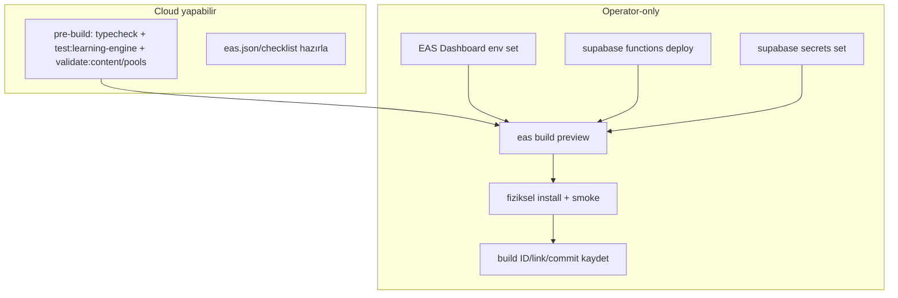

# Release and Build Process

<!-- gh-toc -->

## İçindekiler

- [İki build profili](#iki-build-profili)
- [Build komutu](#build-komutu)
- [AI-enabled preview kurulumu (operator, EAS_PREVIEW_BUILD.md §2–§4)](#ai-enabled-preview-kurulumu-operator-easpreviewbuildmd-24)
- [Pre-flight (EAS_PREVIEW_BUILD §5)](#pre-flight-easpreviewbuild-5)
- [Post-build smoke (özet)](#post-build-smoke-özet)
- [dev-apk'ten çıkınca ne değişir (§7)](#dev-apkten-çıkınca-ne-değişir-7)
- [Operator blocker'ları (release "done" değil bunlar açıkken)](#operator-blockerları-release-done-değil-bunlar-açıkken)
- [Related Notes](#related-notes)

Up: [[Implementation Overview]] · Smoke: [[Smoke Test Playbook]] · Backend: [[Supabase]]

> [!warning] **EAS build, Supabase deploy, secrets ve fiziksel install = operator-only**
> (MASTER_PIPELINE Cloud Mode). Cloud "code-side ready" diyebilir, "shipped/done" diyemez
> (Rule 11). Kaynaklar: `docs/EAS_PREVIEW_BUILD.md`, `docs/DEV_APK_SMOKE_TEST_CHECKLIST.md`.

## İki build profili

| Profil | Stage env | Supabase env | AI | Kullanım |
|---|---|---|---|---|
| **Round 1 dev-apk** | `EXPO_PUBLIC_PRODUCT_STAGE=dev-apk` | **YOK** (env eklenmez) | closed, fallback-only | ilk tester dalgası (L0–L6) |
| **AI-enabled preview** | dev-apk (aiLesson=true) | `EXPO_PUBLIC_SUPABASE_*` set | Edge Functions deploy + secrets | ders-içi AI test (Say It / Mini Conv) |

> [!canon] Round 1 politikası: **Supabase env yok, AI closed.** AI-enabled preview ayrı bir
> operator kurulumdur (EAS_PREVIEW_BUILD.md). `aiEnabled` yine de dev-apk'te false — ders AI'ı
> yalnız Edge Functions + env varsa ve stage sandbox ise gerçek network yapar ([[Feature Flags Map]]).

## Build komutu

```bash
eas build --platform android --profile preview
```

`eas.json` `preview` profili Android apk (internal), `EXPO_PUBLIC_PRODUCT_STAGE=dev-apk`
env'ini taşır. **`.env` çalışan ağaçta `.gitignore`'lu ve EAS tarafından OKUNMAZ** — client
Supabase env'leri yalnız EAS Dashboard'dan gelir (build-time inline).

## AI-enabled preview kurulumu (operator, EAS_PREVIEW_BUILD.md §2–§4)

Ders-içi AI'nın çalışması için **runtime'da üç şey** doğru olmalı; aksi halde APK yüklenir
ama AI sessizce `"Désolé, réessayez."` fallback'i döner:

1. **EAS Dashboard env** (§2): `EXPO_PUBLIC_SUPABASE_URL` + `EXPO_PUBLIC_SUPABASE_ANON_KEY`,
   `Preview` profiline (veya `All`). `eas.json` bunları listelemez.
2. **Edge Functions deploy** (§3): `supabase functions deploy {ai-chat, ai-evaluate, ai-error,
   ai-diag}`; `supabase functions list` → dördü de ACTIVE.
3. **Function secrets** (§4): `supabase secrets set GEMINI_API_KEY=...` (zorunlu/primary);
   GROQ/MISTRAL opsiyonel fallback; ANTHROPIC ai-error için (future). `_shared/providers.ts`
   sırayla fall-through; GEMINI yoksa fonksiyonlar `"No AI providers configured"` 500 döner.

Client tarafı zaten doğru: `lib/supabase.ts` env'leri okur (`supabaseReady = url && anonKey`,
`:10`); `lib/ai.ts` fonksiyonları kullanıcı JWT'siyle çağırır.



## Pre-flight (EAS_PREVIEW_BUILD §5)

- EAS Dashboard'da her iki `EXPO_PUBLIC_SUPABASE_*` (AI preview için).
- `supabase functions list` dördü ACTIVE; `supabase secrets list` GEMINI_API_KEY var.
- Supabase projesi **Active** (paused değil).
- `config/productStage.ts` dev-apk `aiLesson: true` (committed).

## Post-build smoke (özet)

Tam runbook: [[Smoke Test Playbook]]. AI preview'de L1 → §8 Say It Your Way'de kısa French
cümle → ~3 sn AI feedback; §9 Mini Conversation gidip-gel. Sürekli fallback → deploy/secret
doğrula. Chat tab eksikse dev-apk'te **beklenen** (`aiChat:false`).

## dev-apk'ten çıkınca ne değişir (§7)

`EXPO_PUBLIC_PRODUCT_STAGE=public-beta` → `aiChat:true` (Chat tab açılır), `paywall`+`revenueCat`
açılır; `aiEnabled` **yine false** ([[Feature Flags Map]]). Farklı Supabase projesi işaret
ediyorsa §2–§4 tekrar.

## Operator blocker'ları (release "done" değil bunlar açıkken)

- Fiziksel cihaz smoke (rebuilt Lesson Zero `91f1b04`); EAS build + env stratejisi (eas.json vs
  expo.dev); G3 Supabase email-confirmation re-enable (P0); Edge deploy + secrets; **schema
  migration apply (schema-file ≠ deployed DB)**; build ID kaydı. Tam liste [[Known Gaps]],
  [[05 Open Loops]].

> [!warning] **Schema ≠ deployed DB.** `schema.sql` düzenlemesi canlı DB migration'ı değildir;
> `streak` sütunu dosyadan düştü ama deployed DB hâlâ taşıyabilir. Column drop / destructive
> migration public beta öncesi ayrı operator işi ([[Technical Debt]], [[Supabase]]).

## Related Notes

[[Smoke Test Playbook]] · [[Supabase]] · [[Feature Flags Map]] · [[Product Stage Architecture]] · [[Known Gaps]]
