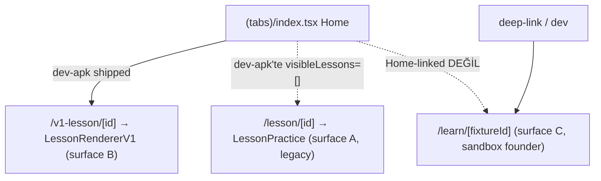

# Route Map

Up: [[Implementation Overview]] · Mimari: [[Route Architecture]] · Matris: [[Route Matrix]]

> [!implemented] expo-router file-based routing. `app/_layout.tsx` Stack'i deklare eder
> (`(tabs)`, `auth`, `lesson/[id]`), `initialRouteName: "(tabs)"` (`app/_layout.tsx:12-58`).
> Her route'un bir **stage/flag gate**'i vardır — kritik: aynı üç ders runtime'ı üç ayrı
> route ağacında yaşar.

## Route tablosu

| Route dosyası | Amaç | Stage/flag gate |
|---|---|---|
| `(tabs)/index.tsx` | Home "Journey": daily review, milestones, legacy lessons, v1 path | her zaman; içerik stage'e göre değişir |
| `(tabs)/chat.tsx` | AI Chat tab | tab gizli, `FEATURES.aiChat` yoksa (`(tabs)/_layout.tsx:44`) |
| `(tabs)/practice.tsx` | Scenario/flashcard practice | gizli, `FEATURES.practice` yoksa (`_layout.tsx:57`) |
| `(tabs)/stats.tsx` | Progress (legacy 24-lesson) | gizli, `FEATURES.progress` yoksa (`_layout.tsx:70`) |
| `auth.tsx` | Sign in/up | yalnız `supabaseReady` ise (Home CTA'yı gate'ler) |
| `lesson/[id].tsx` | **Surface A** legacy runtime | `visibleLessons` boş değilse (dev-apk'te boş) |
| `v1-lesson/[id].tsx` | **Surface B** v1 authored runtime | Home path'i sandbox\|dev-apk'te gösterir (`index.tsx:152-153`) |
| `learn/[fixtureId].tsx` | **Surface C** founder engine shell | `PRODUCT_STAGE==="sandbox" && FEATURES.v1LessonEngine` (`learn/[fixtureId].tsx:32-33`) |
| `dev/learning-engine-player.tsx` | Engine debug player | `PRODUCT_STAGE==="sandbox" && __DEV__` (`:529`) |
| `dev/learning-engine-preview.tsx` | Engine preview | sandbox/dev only |
| `lesson-zero.tsx` | İlk-açılış onboarding (redirect target) | ilk launch, `lm7_seen_lesson_zero` yoksa (`index.tsx:26,60-64`) |
| `how-weave-works.tsx` | Weave explainer | erişilebilir route; artık zorunlu first-run değil (`index.tsx:56-59`) |

## Ders route'ları — üç ağaç, kesişmez

- **Surface A gizleme:** `visibleLessons = PRODUCT_STAGE === "dev-apk" ? [] : LESSONS`
  (`index.tsx:149`) — dev-apk'te legacy hiç çizilmez.
- **Surface B açma:** Home path'i yalnız sandbox\|dev-apk'te gösterilir (`index.tsx:152-153`);
  `/v1-lesson/[id]` → `getV1LessonById` → `<LessonRendererV1>` (`app/v1-lesson/[id].tsx:8,37`).
- **Surface C izolasyonu:** `/learn/*` **asla Home-linked değil**, deep-link + çift koşul
  (sandbox && flag). Bkz. [[Decision Index|D-09]].

> [!warning] Karışık gate idiom'u: `aiChat`/`practice`/`progress`/`dailyReview` **flag** ile
> kontrol edilir; v1 path ve `/learn` route'u ise **doğrudan `PRODUCT_STAGE ===`** karşılaştırması
> kullanır — kasıtlı ("Home-only condition; does NOT flip the v1LessonEngine feature flag",
> `index.tsx:150-153`). Yani "v1 görünür" ≠ "v1LessonEngine flag açık".

Feature bayraklarının stage × değer matrisi ayrı nottadır: [[Feature Flags Map]].
Fail-closed stage çözümü (`dev-apk`) [[Feature Flags Map]] ve [[Product Stage Architecture]]'da.

## Known Gaps

- B13: legacy `/lesson/[id]` deep-link guard yok (dev-apk'te route dosyası hâlâ mevcut,
  yalnız Home linki gizli) → [[Known Gaps]], PR-O.
- B20: `lemot://` deep-link scheme notu açık → [[Known Gaps]].

## Related Notes

[[Route Architecture]] · [[Route Matrix]] · [[Feature Flags Map]] · [[Navigation Model]] · [[Runtime Lesson Map]]
