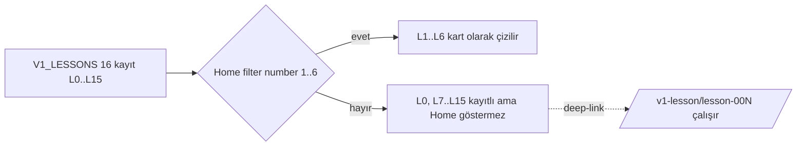

# Runtime Lesson Map

Up: [[Implementation Overview]] · Kanon spine: [[Syllabus Overview]] · Statü: [[Lesson Status Matrix]]

> [!implemented] Bu not **surface B** (static authored v1) runtime'ının GERÇEK ders
> envanteridir — dosya sisteminden okundu, spec'ten değil. `content/lessons/v1/` altında
> **16 dosya** (`lesson-000.ts` … `lesson-015.ts`, yani L0–L15) vardır; hepsi
> `V1_LESSONS[]`'e kayıtlıdır (`content/lessons/v1/index.ts:19-40`).

## Ders tablosu — L0..L15 (surface B)

| Dosya | `number` | Ders (başlık) | `V1_LESSONS` kayıtlı? | Öğrenciye görünür | Doc tipi / içerik olgunluğu |
|---|---|---|---|---|---|
| `lesson-000.ts` | 0 | [[L0 The First Step|L0 First French Moment]] | ✅ | Deep-link only (Home göstermez) | Bridge twin; canlı L0 = hardcoded `app/lesson-zero.tsx` |
| `lesson-001.ts` | 1 | [[L1 Survival Kit|L1 Survival Kit]] | ✅ | ✅ Home L1–L6 | Round 1 tam içerik (FROZEN/ACCEPTED) |
| `lesson-002.ts` | 2 | [[L2 Être|L2 Être]] | ✅ | ✅ | Round 1 tam içerik |
| `lesson-003.ts` | 3 | [[L3 Non|L3 Non (ne…pas)]] | ✅ | ✅ | Round 1 tam içerik (ilk factory dersi) |
| `lesson-004.ts` | 4 | [[L4 J'ai|L4 J'ai (avoir-state)]] | ✅ | ✅ | Round 1 tam içerik |
| `lesson-005.ts` | 5 | [[L5 Un Une|L5 Un/une (article packages)]] | ✅ | ✅ | Round 1 tam içerik |
| `lesson-006.ts` | 6 | [[L6 Un Petit Moment|L6 Un petit moment]] | ✅ | ✅ | Round 1 integration payoff (FROZEN) |
| `lesson-007.ts` | 7 | [[L7 Je Vais|L7 Je vais (Aller)]] | ✅ | ❌ Home-gated | Unit 2 pilot; compact/de-scoped |
| `lesson-008.ts` | 8 | [[L8 Location Questions|L8 Location Questions]] | ✅ | ❌ Home-gated | Unit 2 pilot; compact |
| `lesson-009.ts` | 9 | [[L9 Faire Une Pause|L9 Faire une pause]] | ✅ | ❌ Home-gated | Unit 2 pilot; compact |
| `lesson-010.ts` | 10 | [[L10 Integration|L10 Integration]] | ✅ | ❌ Home-gated | Compact/de-scoped |
| `lesson-011.ts` | 11 | [[L11 Pouvoir|L11 Pouvoir]] | ✅ | ❌ Home-gated | Compact |
| `lesson-012.ts` | 12 | [[L12 Est-ce Que|L12 Est-ce que]] | ✅ | ❌ Home-gated | Compact; boundary (recognition-only) form içerir |
| `lesson-013.ts` | 13 | [[L13 Integration|L13 Integration]] | ✅ | ❌ Home-gated | Compact |
| `lesson-014.ts` | 14 | [[L14 Y|L14 Y]] | ✅ | ❌ Home-gated | Compact |
| `lesson-015.ts` | 15 | [[L15 Devoir Falloir|L15 Devoir/Falloir]] | ✅ | ❌ Home-gated | Compact |
| _(dosya yok)_ | 16 | [[L16 Integration and Small Moment|L16]] | ❌ | ❌ | **SPEC-ONLY** (fixture var, v1 dosyası yok) |
| _(dosya yok)_ | 17 | [[L17 Human Context and Feelings|L17]] | ❌ | ❌ | **SPEC-ONLY** (roadmap/doorway doc) |

Statü etiketleri: L1–L6 **IMPLEMENTED + VERIFIED** (emülatör smoke #136/`8cefe81`,
P0–P3 sıfır, FROZEN). L7–L15 **IMPLEMENTED (kayıtlı) ama Home-gated** — kod var,
kullanıcı görmüyor. L16–L17 **SPEC-ONLY**.

## Görünürlük mekaniği — neden L7+ gizli

Home "Your path" kartlarını `number` 1..6 aralığına filtreler ve
`/v1-lesson/{id}`'ye push eder (`app/(tabs)/index.tsx:158-161,364`). Yani L7–L15
dosyaları `V1_LESSONS`'ta **kayıtlı ve erişilebilir** (deep-link `/v1-lesson/lesson-007`
çalışır) ama Home onları çizmez — **Home-cap `number <= 6`**. L0 ise ayrı: bridge
deneyimi hardcoded `app/lesson-zero.tsx` üzerinden ilk açılışta gösterilir; `lesson-000`
yapısal ikizi deep-link için kayıtlı tutulur (bkz. [[Decision Index|D-06]]).

## ⚠️ Çözülmüş divergence: "7 ders" (stale) vs 16 dosya (gerçek)

> [!warning] STATUS.md'nin "7 lessons" ifadesi **stale bir `91f1b04` snapshot'ıdır.**
> O commit'te v1 klasöründe 7 dosya vardı; **working tree bugün 16 dosya taşıyor**
> (`lesson-000`…`lesson-015`). Bu, statü doküman ile kaynak kod arasındaki tipik
> zaman-gecikmesidir. **RESOLVED:** doğrusu 16 kayıtlı dosya, öğrenciye görünür 6
> (L1–L6). Bu satır [[Spec Runtime Divergences]] ve [[Contradictions]]'da da işaretlidir.

Kanıt: `content/lessons/v1/index.ts:19-40` 16 girişli `V1_LESSONS[]` dizisini listeler;
`getV1LessonById` (`index.ts:44`) hepsini çözer; `v1LessonStructure.test.ts` şekil kontratını
16 ders üzerinde doğrular.

## Scoring gerçeği (surface B)

Surface B'de **per-screen scored gate yoktur.** Tamamlama tek monoton işaret:
`{number}-read_listen`, ders sonunda bir kez yazılır (`LessonRendererV1.tsx:23,38`);
Home aynı anahtarı lineer unlock için okur (`index.tsx:29-32,164-176`). `FillWithTraps` /
`Weave` / `SayItYourWay` ekranları yerel eşleşme yapar (`lib/lessonZeroAnswers.ts`,
`lib/looksFrench.ts`, `lib/normalize.ts`) ama ilerlemeyi **bloke etmez** — CLAUDE.md'nin
"no scoring, no ceremony" ifadesi. Gerçek mastery/scoring surface C'dedir (bkz.
[[Mastery Model]], [[Module Ownership Map]]).

## Known Gaps

- L7–L15 "compact/de-scoped" — Round 1 kalitesinde değil; Home-cap kaldırma PR'ı açık
  (KNOWN_GAPS #3, [[Known Gaps]]).
- L16–L17 fixture var ama v1 authored dosyası yok → [[Spec Runtime Divergences]].
- Ders tamamlama "birim"i tanımı açık (F5: Home tamamlama sonrası hâlâ "Begin the first
  lesson" der) → [[Known Gaps]], [[05 Open Loops]].

## Related Notes

[[Lesson Status Matrix]] · [[Syllabus Overview]] · [[Route Map]] · [[Runtime Content Architecture]] · [[Spec Runtime Divergences]]
