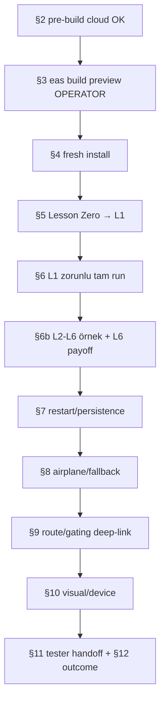

# Smoke Test Playbook

Up: [[Implementation Overview]] · Build: [[Release and Build Process]] · Mekanik test: [[Test Strategy]]

> [!warning] **Fiziksel smoke = operator-only.** Cloud oturumları §2 pre-build komutlarını
> çalıştırabilir ama **bu dosyadan tek başına "smoke PASS" iddia edemez** (MASTER_PIPELINE
> Rule 11). `scripts/dev/android-smoke.sh` (#140) emülatör screenshot kolaylığıdır, zorunlu
> yol değil, checklist yerine geçmez. Kaynak: `docs/DEV_APK_SMOKE_TEST_CHECKLIST.md`.

## Round 1 kapsamı ve politikası

Android internal APK, **yalnız dev-apk stage**, **Supabase env yok**, **AI closed
(fallback-only)**. Smoke yüzeyi = **L0 Lesson Zero bridge + v1 L1–L6**. L1 = zorunlu
uçtan-uca run; L2–L6 erişilebilirlik + L6 integration payoff için örneklenir. Round 1
runtime `8cefe81` (#136) ile ACCEPTED & FROZEN; ama operator device smoke **rebuilt
Lesson Zero'yu `91f1b04`'te yeniden kapsamalı** (#139/#141 sonrası) → [[Decision Index|D-39]].

## Cihaz-günü runbook (§ eşlemeli)

| Adım | §CL | Ne doğrulanır |
|---|---|---|
| 1. Build metadata kaydet | §1 | commit hash, PR range, EAS profile `preview`, build ID/link, cihaz modeli, Android sürümü, tarih, operator adı |
| 2. Pre-build checks (cloud OK) | §2 | `git status` temiz + pull; `typecheck` temiz; `test:learning-engine` yeşil; `validate:pools` exit 0 (**6 known legacy warning kabul**); `validate:content` 0 hard/0 warn/0 info; `eas.json` preview; `EXPO_PUBLIC_PRODUCT_STAGE=dev-apk`; **Supabase env YOK**; `aiEnabled` dev-apk/public-beta false, yalnız sandbox true |
| 3. Build | §3 | `eas build --platform android --profile preview` → build ID/link kaydet |
| 4. Install & fresh start | §4 | temiz cihaz/veri; sandbox/dev yüzeyi görünmez; tab bar yalnız **Journey**; Chat/Practice/Progress gizli |
| 5. First-run chain | §5 | Lesson Zero ilk açılışta; #139 rebuilt akış temiz install'dan tamamlanır; #141 nudge hint'leri capli; L0 sonra tekrar tetiklenmez; L0 → L1'e gider; **How Weave Works otomatik gösterilmez** ama `/how-weave-works` route'u erişilebilir; Home Sign In göstermez; L1 açık, L2–L6 sıralı kilit; **L7+ / legacy 24-lesson görünmez**; Practice/Chat/Paywall/Word Graph/Mon Lexique yok |
| 6. Lesson 1 (zorunlu tam run) | §6 | tüm ekranlar sırayla; Fill-with-traps doğru grade + seçimden sonra lock; Weave input/check/reveal; **ardışık Weave ekranları metin/state taşımaz**; Say It Your Way model-answer **AI network kullanmadan**; completion ekranı; Back to Home çalışır |
| 6b. L2–L6 örnek | §6b | L1 sonrası L2 unlock; L3/L4/L5 sıralı; her ders ilk ekranı crash/blank olmadan; **L6 "au revoir" integration close** (L1–L5 recombination); tam L2–L6 completion Round-1 blocker değil |
| 7. Restart & persistence | §7 | ders ortasında kill+relaunch crash yok, L0/HWW tekrar yok; tamamlanan ders done kalır, sonraki unlock kalır; onboarding flag'leri kalıcı |
| 8. AI/offline/fallback | §8 | Round 1 yolu AI network gerektirmez; AI-disabled fallback crash yok; **airplane mode**'da first-run + L1 çalışır; kafa karıştıran fallback copy not al |
| 9. Route/gating deep-link | §9 | `/auth`→Home; `/chat`,`/practice`→gizli, Home'a döner; `/dev/learning-engine-{player,preview}`→Home; `/learn` sandbox yok; legacy lesson deep-link Round-1 blocker değil |
| 10. Visual/device | §10 | klavye input'ları (Weave, Say It) bloke etmez; tap target'lar; küçük viewport clip/overflow yok; **TTS yalnız French, placeholder speech yok**; Android back button dead-end/crash yok |
| 11. Tester handoff | §11 | "AI closed, network gerekmez, account yok"; tester'a tek soru: **"At which point did you feel bored, confused, or tempted to stop?"** (verbatim kaydet); L1 bitirdi mi; 72 saatte tekrar açtı mı; L2 başladı mı |
| 12. Outcome | §12 | PASS / PASS WITH NOTES / FAIL + blocker'lar + non-blocking not + smoke-bucket follow-up |

## Smoke akışı (özet)

## Bilinen non-blocker'lar (smoke'ta görülecek ama FAIL değil)

- Home tamamlama sonrası hâlâ "Begin the first lesson" (F5); Daily Review 0/5; Progress
  legacy taksonomi → hepsi [[Known Gaps]]/[[Technical Debt]], learning-engine adoption'a ait.
- `stats`/Progress legacy 24-lesson yüzeyi Round 1 L0–L6 kapsamı dışında (§4).

## Related Notes

[[Release and Build Process]] · [[Test Strategy]] · [[Device Verification Matrix]] · [[Dev APK Scope]] · [[Known Gaps]]
