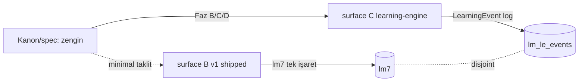

# Spec Runtime Divergences

Up: [[Implementation Overview]] · Matris: [[Spec to Runtime Matrix]] · Borç: [[Technical Debt]]

> [!warning] **Taç not.** Bu vault'un varlık sebebi burada yoğunlaşır: **spec/kanon ne diyor**
> ile **runtime ne yapıyor** çoğu yerde AYNI DEĞİL. Aşağıdaki her satır bir uçurumdur;
> her birinin bir **statüsü** ve **canonical ev nota işaretçisi** vardır. Bir uçurumu
> "bug" sanma — çoğu **kasıtlı faz sıralaması** (spec önde, runtime arkada).

## Divergence envanteri

| # | Spec / kanon der ki | Runtime yapar ki | Statü | Canonical ev |
|---|---|---|---|---|
| 1 | Zengin chip taksonomisi (spine/pattern/formula/noun-package/ghost/carryover/accounting/UI ayrımları) | `LearningItemStatus` = **4-value enum** `active\|supported\|recognition\|recycled` (`lessonTypes.ts:3-7`) + `LearningItemType` **16 tip** (`:8-23`) | **DEFERRED** (taksonomi kanon-katmanı; runtime düz enum) | [[Chip Taxonomy]] |
| 2 | Çok-durumlu production/lexique ladder (D-35 "intrinsic 8-state lifecycle", Mon Lexique 6-band) | runtime `monLexiqueStatus` = **3 değer** `hidden\|added\|weak` | **DEFERRED** (ladder tasarlandı, runtime kısaltılmış) | [[Mastery Model]] · [[Mon Lexique]] |
| 3 | Tek kanonik ilerleme spine'ı (event log = source of truth) | **iki disjoint store**: `lm7` (Home/Progress/Daily Review) vs `lm_le_events` (engine, "never reads/writes `lm7`", `repository/local.ts:14-38`) | **LOCKED-open** ("main integration blocker") | [[Decision Index|D-10]] · [[Storage Architecture]] |
| 4 | Her öğrenci eylemi bir `LearningEvent` üretir; her şey projeksiyondur (D-11) | **surface B (v1) hiç LearningEvent emit etmez**; tek monoton `{n}-read_listen` işareti yazar (`LessonRendererV1.tsx:23,38`) | **PLANNED** (v1 geçici; event spine surface C'de) | [[Self-Producing Engine]] · [[Runtime Lesson Map]] |
| 5 | Lesson Flow Canon §11 tüm kurallar validator'lanmalı | yalnız **V3/V4/V5 mekanize** (`canonRules.ts`, #187); **V1/V2/V6/V7/V8/V9 kasıtlı ertelendi** (schema alanları / final layout gerekli) | **PARTIAL** (V3/V4 hard error, V5 warning) | [[Test Strategy]] · [[Validation Gates]] |
| 6 | itemId manifest = registry (K3 çift-yön) | registry **54 anahtar** ama manifest **56 id** (L1_L15 audit ayrıca 52/41/11) | **UNKNOWN** (`validate:content` yeşil mi çalıştırılmadı) → [[Needs Verification]] | [[Registry Map]] |
| 7 | Meet/Insight/Recap ekranları per-screen etkileşimli (touch-to-decompose, Faz B) | runtime'da Meet/Insight/Recap = **statik Continue ekranları** | **PLANNED (Faz B)** | [[Meet]] · [[Insight and Notice]] · [[Review]] |

## Ek çözülmüş / yapısal uçurumlar

| Uçurum | Detay | Statü |
|---|---|---|
| "7 ders" vs 16 dosya | STATUS.md "7 lessons" = stale `91f1b04` snapshot; working tree **16 dosya** L0–L15 | ✅ **RESOLVED** (doğru = 16 kayıtlı, 6 görünür) → [[Runtime Lesson Map]] |
| L16–L17 | fixture/roadmap var, **v1 authored dosya YOK** | **SPEC-ONLY** → [[Runtime Lesson Map]] |
| Authored type alanları consumed değil | `Lesson` tipi `practicePool/dailyReviewHooks/monLexiqueEntries/offlineBehavior` taşır ama `LessonRendererV1` bunları **tüketmez** (`lessonTypes.ts:302-330`) | SPEC-ONLY fields on IMPLEMENTED runtime → [[Lesson Anatomy]] |
| Rich pedagoji enum'ları | `LessonPhase`(7), `MonolingualMode`(5), `LessonArchetype`(8), `ValidationMode`(4), `WeaveType`(4), 8-band NaturalReveal (`lessonTypes.ts:66-79`) authored ama runtime çoğunu kullanmaz | DEFERRED → [[Lesson Flow]] |
| Model-routing (Claude Haiku) | CLAUDE.md tablosu implemented provider'larla (gemini/groq/mistral) çelişir | doc borcu (D2) → [[Contradictions]] |

## Neden bu kadar çok uçurum var (kısa "why")

CLAUDE.md banner'ı der ki: **v1 geçici smoke yüzeyi, learning-engine uzun vadeli temel.**
Yani zengin spec (chip taksonomisi, mastery ladder, event spine, per-screen interaction)
**bilinçli olarak learning-engine/surface C'de** yaşar; surface B ise onların minimal,
statik bir taklidini sevk eder. Uçurumların çoğu **faz sıralaması** (Faz B/C/D), birkaçı
gerçek **borç** (iki-store, 54/56 drift). Bkz. [[Decision Index|D-08]], [[Technical Debt]].

## Related Notes

[[Spec to Runtime Matrix]] · [[Chip Taxonomy]] · [[Mastery Model]] · [[Self-Producing Engine]] · [[Test Strategy]] · [[Technical Debt]]
