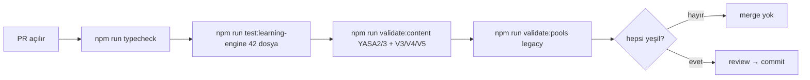

# Test Strategy

Up: [[Implementation Overview]] · Gate'ler: [[Validation Gates]] · Cihaz: [[Smoke Test Playbook]]

> [!implemented] Üç mekanik kapı: **`test:learning-engine`** (42-dosya saf-Node runner),
> **`validate:content`** (YASA 2/3 + canon V3/V4/V5), **`validate:pools`** (legacy içerik).
> Hepsi `tsx`-run Node script (`package.json:6-16`). Karpathy kuralı: engine mantığı
> **testleriyle birlikte sevk edilir**; PR öncesi üçlü validation yeşil ([[Decision Index|D-12]]).

## 1. `test:learning-engine` — 42-dosya runner

`scripts/tests/run.ts` **42 `*.test.ts` dosyasını** import eder ve custom `harness.ts`
(`describe`) ile çalıştırır; saf Node/tsx — **"NO React Native / Expo / device layer is
loaded"** (`run.ts:1-50`). Storage'a dokunan her modül **injected in-memory KV adapter**
kullanır → deterministik, cihazsız.

Suite kümeleri:

| Küme | Örnek test dosyaları |
|---|---|
| privacy | `privacy`, `privacyLocal`, `privacyData`, `localPrivacyCompleteness`, `privacyResetBarrier` |
| storage | `safeStorage`, `blobStore`, `secureAuthStorage`, `lessonProgress` |
| engine | `mastery`, `grade`, `answerCheck`, `selectors`, `carryover`, `lexiqueMemory`, `boundaryAndDue`, `compaction`, `migrations`, `deriveDrill`, `deriveFillBoundary`, `errorEngine`, `contextChain*`, `nearMissMasteryTiming`, `buildSequence` |
| contracts | `aiContract`, `reviewScore`, `localRepository`, `telemetry` |
| guards | `devApkScope`, `devApkCopyGuard`, `componentCopyGuard`, `productStageResolution`, `noSupabaseAuthGuard`, `ttsPlaceholder`, `weaveMatch`, `weaveCopy`, `v1LessonStructure` |
| manifests | `shippedItemIds`, `shippedErrorTags`, `canonRules` |
| misc | `lessonZeroAnswers` |

> [!warning] **Guard testleri = kanon enforcement.** Banned copy ("streak/XP/reward") mekanik
> olarak `devApkCopyGuard`/`componentCopyGuard`/`weaveCopy` ile yakalanır; `noSupabaseAuthGuard`,
> `v1LessonStructure` şekil kontratı. CLAUDE.md "no gamification language" kanonu böyle
> **koda gömülü** ([[Decision Index|D-01]]).

## 2. `validate:content` — canon + YASA validator

`scripts/validateContent.ts` (`:1-56`): önce aggregate `LEARNING_ENGINE_FIXTURE`'ı doğrular,
sonra:

- **(a) YASA 2** shipped itemId immutability + **K3 çift-yön** (`:37-46`) → HARD ERROR.
- **(b) YASA 3** shipped error-tags (`:48-56`) → HARD ERROR.
- **(c) Lesson Flow Canon §11** mekanize alt-kümesi via `scripts/canonRules.ts` (`V1_LESSONS`
  üzerinde): **V3/V4** exposure-tier misuse = **hard error**, **V5** insight budget = **warning**.

Herhangi bir hard error'da exit 1. **V1/V2/V6/V7/V8/V9 kasıtlı olarak mekanize DEĞİL**
(schema alanları / final layout gerekli) → [[Spec Runtime Divergences]] #5.

## 3. `validate:pools` — legacy içerik (surface A)

`scripts/validatePools.ts` (`:1-31`): **legacy** `data/lessons` + `data/pools` doğrular
(Weave-fill `fr` varlığı L1–L5, placeholder/İngilizce sızıntı, çift-negasyon, FlashCard
lessonId bütünlüğü). Errors bloke; bazı legacy içerik yalnız **warning** tetikler. Bu
validator **surface A'yı** hedefler, v1 authored dersleri DEĞİL.

> [!warning] **Latest recorded counts + staleness caveat:** `validate:pools` legacy içerikte
> **6 warning** kaydeder (KNOWN_GAPS/audit). `test:learning-engine`'in **42 dosyası** ve
> `validate:content`'in yeşil olup olmadığı bu read-only geçişte **çalıştırılmadı** → sayımlar
> reported-only; özellikle 54-vs-56 item-id drift altında `validate:content`'in geçtiği
> **UNKNOWN** ([[Registry Map]], [[Needs Verification]]).

## Üçlü kapı akışı

## Test edilmeyen alanlar (borç)

- `useSRS` Leitner core untested (C11); cloud-merge helpers untested (C4); 519 LOC edge
  functions unchecked (C13) → [[Technical Debt]], [[Known Gaps]].
- Cihaz/emülatör smoke ayrı katman (bu runner yüklemez) → [[Smoke Test Playbook]].

## Related Notes

[[Validation Gates]] · [[Test Coverage Matrix]] · [[Registry Map]] · [[Spec Runtime Divergences]] · [[Smoke Test Playbook]]
