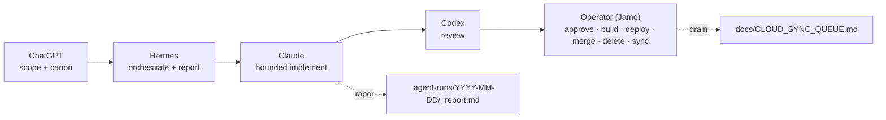

# Agent Collaboration

<!-- gh-toc -->

## İçindekiler

- [Executive Summary](#executive-summary)
- [Why It Exists](#why-it-exists)
- [Current Canon](#current-canon)
- [How It Works](#how-it-works)
- [Failure Modes](#failure-modes)
- [Examples](#examples)
- [Runtime Implementation](#runtime-implementation)
- [Known Gaps](#known-gaps)
- [Open Questions](#open-questions)
- [Decision History](#decision-history)
- [Related Notes](#related-notes)

> [!canon] Purpose — Kim ne yapar: **Hermes · Claude · Codex · Operator · ChatGPT** rolleri ve **away-agent** (operatör yokken bounded ilerleme) iş akışı.

## Executive Summary

`LE_MOT_AGENT_CONSTITUTION` (v0, 2026-05-28) beş rol tanımlar ve bir **away-agent** modeli kurar: operatör yokken bounded bir ajan yalnızca **düşük-riskli, iyi-scope'lu** işlerde ilerler ve **yalnızca local rapor** (`.agent-runs/`) üretir. İki away modu: `report-only` ve `propose-only`. App-kodu edit'i veya gerçek PR **away-eligible değildir** → `ACTION_REQUIRED`. Away otonomisi etkin biçimde **LM-1/LM-2** ile sınırlıdır; LM-3+ attended oturum ister. Tek satır: *"ChatGPT scope'lar → Hermes orkestre eder + raporlar → Claude implement eder (bounded) → Codex review eder → Operator onaylar, build/deploy/merge/delete/sync yapar."*

## Why It Exists

Mesajlaşma entegrasyonu (Telegram/WhatsApp/push) kasıtlı olarak scope dışı. Amaç, operatör uzaktayken güvenli ilerleme + dürüst raporlama; **kalıcı kararlar** ve **privileged aksiyonlar** (commit/merge/build/deploy/secrets/silme) tek elde (Operator) toplanır. Away workflow, MASTER_PIPELINE'ın kısıtlı bir alt kümesidir.

## Current Canon

### Roller (§1)

| Rol | Ne yapar | Ne yapmaz |
|---|---|---|
| **Hermes** | Orchestrator / reporter / queue runner | Kod implement etmez; kendini onaylamaz |
| **Claude** | Bounded implementer — tek queue task, `allowed files` içinde, en küçük doğru değişiklik | Scope dışına çıkmaz; onaysız commit atmaz |
| **Codex** | Bağımsız reviewer — değişikliği yazmamıştır | Sadece review; kod yazmaz ([[Codex Review Workflow]]) |
| **Operator (Jamo)** | Final onay + privileged: commit, merge, APK rebuild, EAS env, Supabase deploy, secrets, fiziksel smoke, branch delete, Sync Queue drain. Onay ifadeleri `devam`/`onaylandı`/`commit` | — |
| **ChatGPT** | Workflow controller — scope'lar/sıkılaştırır, canon çözer | Körlemesine kod yönlendirmez |

> Precedence: `CLAUDE.md → DEV_APK_MVP_CANON.md → MASTER_PIPELINE → Agent Constitution`. Bu dosya aktif canon'a tabidir.

### İki away modu (§2)
- **report-only** — yalnızca `.agent-runs/`'a yazar.
- **propose-only** — rapor + inline önerilen diff/copy, **asla canon'a uygulanmaz**.
- App-kodu edit'i veya gerçek PR gereken her şey away-eligible değildir → attended oturum için `ACTION_REQUIRED`.

### İzinli (unattended, §3)
Herhangi dosyayı oku; read-only komutlar (`git status/log/diff/branch`, `npm run typecheck`, `npm run validate:pools`, `npx expo-doctor`); rapor/öneri üret; follow-up flag'le.

### Yasak (unattended, §4 — hard limits)
> [!warning] App kodu edit etme; package manifest/lockfile mutasyonu / `npm install`; Supabase (schema/functions/RLS/secrets); EAS/build config; build/deploy; **merge veya main'e push**; o run'da oluşturulmayan branch/tag/dosya silme; secret yazma/echo; `graphify-out/` stage etme; onay ifadesinden önce commit; yasak dil revival; herhangi giden mesaj. Özet: *"No merge, build, deploy, delete, secrets, or package mutation — unless the Operator has explicitly approved it."*

### Bloke olunca (§5)
Dur; `## Blockers` + `## ACTION_REQUIRED` kaydet; kısmi ilerlemeyi koru; queue'yu yalnızca bağımsızsa ilerlet; asla sessizce yutma. Detay: [[Incident and Blocker Handling]].

## How It Works

### Rapor formatı (§6)
Tam olarak bir dosya: `.agent-runs/YYYY-MM-DD/<task-id>_report.md`. Bölümler: Task / Repo state / Completed / Files changed / Verification / Draft PRs opened / Blockers / ACTION_REQUIRED / Not done by rule / Recommended next step. Dürüst statü; "proposed" asla "done" değil; kalıcı kararlar `docs/CLOUD_SYNC_QUEUE.md`'ye kuyruklanır.

## Failure Modes
- **Hermes'in kendini onaylaması / kod yazması** → rol ihlali.
- **Away ajanının LM-3+ işe girmesi** → yasak; attended gerekir.
- **Bloke'yi sessizce yutmak** → yasak; `ACTION_REQUIRED` şart.

## Examples
> [!example]
> Seeded queue (`AWAY_TASK_QUEUE.md`): TASK-001 post-APK docs backfill (propose-only), TASK-002 fiziksel APK smoke checklist finalize (propose-only), TASK-003 branch cleanup audit (report-only), TASK-004 Sprint 12 closure readiness report (report-only) — hepsi READY, hepsi LM-1/LM-2. Detay: [[Task Context Packs]].

## Runtime Implementation
### Code References
Süreç kanonu; kod yok. Raporlar `.agent-runs/` altında; queue `docs/agents/AWAY_TASK_QUEUE.md`.
### Product-Stage Availability
Tüm stage'lerde bağlayıcı.

## Known Gaps
- Codex rutin-kapısı ve Hermes orkestrasyonu **partial** icra edildi (çoğunlukla loop-audit'ler + operatör el emeği).

## Open Questions
> [!open-loop] Mesajlaşma entegrasyonu kasıtla dışarıda; ileride gerekirse ayrı bir karar. → [[05 Open Loops]]

## Decision History
- Agent Constitution v0 (2026-05-28) — beş rol, iki away modu, hard limits.

## Related Notes
[[Task Context Packs]] · [[Claude Code Workflow]] · [[Codex Review Workflow]] · [[Incident and Blocker Handling]] · [[Development Workflow]] · [[00 Le Mot Holy Codex]]
