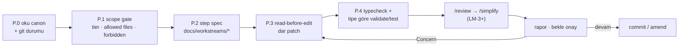

# Claude Code Workflow

<!-- gh-toc -->

## İçindekiler

- [Executive Summary](#executive-summary)
- [Why It Exists](#why-it-exists)
- [Current Canon](#current-canon)
- [How It Works](#how-it-works)
- [Failure Modes](#failure-modes)
- [Examples](#examples)
- [Runtime Implementation](#runtime-implementation)
- [Known Gaps](#known-gaps)
- [Open Questions](#open-questions)
- [Decision History](#decision-history)
- [Related Notes](#related-notes)

> [!canon] Purpose — Claude Code'un (implementer) pipeline içinde nasıl davrandığı: rol sınırı, executor döngüsü ve **Karpathy engine-purity kontratı**. Faz detayı için canonical ev: [[Development Workflow]].

## Executive Summary

Claude Code, Cairn'in **bounded implementer**'ıdır: canon okur, dosya-bazlı değişiklik yapar, TypeScript/RN/Expo kodu yazar, validasyon çalıştırır, diff üretir, review raporu verir — ama **canon kararı uydurmaz, kullanıcı onayı olmadan commit atmaz.** Executor döngüsü [[Development Workflow]]'daki P.0–P.7'yi izler. Motor koduna dokunuyorsa **Karpathy saflık kontratı** (pure/deterministic/explicit now/explicit fail) test-locked olarak bağlar.

## Why It Exists

İki risk: (1) ajanın canon'ı hafızadan uydurması, (2) büyük ürün yönünü kullanıcı onayı olmadan değiştirmesi. Rol ayrımı bunları engeller: **ChatGPT scope'lar → Claude implement eder (bounded) → Codex review eder → Operator onaylar/build/deploy/merge.**

## Current Canon

### Rol sınırı (yapar / yapmaz)

> [!canon] Claude Code **yapar:** repo okur, dar dosya değişikliği, TS/RN/Expo kodu, diff, typecheck/test, commit/PR hazırlığı, `/review`/`/simplify`/`/graphify` (mevcutsa).
> Claude Code **yapmaz:** canon kararı uydurmaz; legacy kararı aktif sanmaz; paywall/monetization/lesson-flow'u onaysız yeniden tasarlamaz; yasak dili (streak/XP/level up/amazing) geri sokmaz; **onay olmadan commit atmaz**; review concern'ünde amend gerekip gerekmediğini atlamaz.

### Executor döngüsü (default task)

### Karpathy engine-purity kontratı (motor kodu — dört madde, testlerle kilitli)

> [!canon]
> 1. **PURE** — storage yok, network yok, React yok, AI yok, gizli state yok.
> 2. **DETERMINISTIC** — aynı girdi → hep aynı çıktı; eşitlikler açıkça bozulur.
> 3. **EXPLICIT `now`** — saat bir parametredir; motor mantığında `Date.now()`/`Math.random()` **asla** görünmez.
> 4. **FAIL BEHAVIOR EXPLICIT** — her fonksiyon kötü girdide ne olacağını söyler; varsayılan **fail-closed** (`null`/"unsupported" döndür, veriyi değiştirme), asla yarım sonuç, asla sessiz veri kaybı.

Bağlayıcılık: her PR'dan önce **üçlü validasyon yeşil** (`typecheck`, `validate:content`, `test:learning-engine` — [[Validation Gates]]); yeni motor mantığı **kontrat testleriyle aynı PR'da** gelir; sistem yasaları her PR'a biner (YASA 1 schema→migration aynı PR; YASA 2 itemId immutability); **golden rule of screenless work** — görülmemiş UI davranışı asla merge edilmez, `[awaiting device pass]` etiketli branch'te bekler.

## How It Works

### Inputs
Default executor prompt (MASTER_PIPELINE §11): Task, Tier, Allowed files, Forbidden list, Acceptance criteria, Tests, Report format. Task-özel bağlam: [[Task Context Packs]].

### Outputs
Dar diff + rapor. Rapor formatı: Summary / Files changed / Tests run / Manual QA needed / Risks / Skill substitutions (cloud) / Sync Queue items (cloud) / Suggested commit message.

### Main Rules
- **Read before edit.** Opportunistic refactor yok; docs görev kapsamında değilse docs güncellenmez.
- **Expo Router typed routes:** yeni route sonrası tip regenerasyonu beklenir; gerekirse dar/geçici `"/route" as never` — asla geniş `as any`.
- **Schema'ya dokunulduysa** deployed-DB migration gerekip gerekmediği raporda belirtilir (schema-file ≠ deployed DB).

### Guardrails
Away modunda Claude sadece LM-1/LM-2 iş yapar; app-kodu edit'i veya gerçek PR away-eligible değildir ([[Agent Collaboration]]). Cloud kuralları [[Development Workflow]]'daki Cloud Mode Addendum ile aynı.

## Failure Modes
- **Broad `as any` route cast** kalıcı çözüm olarak bırakılırsa tip güvenliği bozulur → dar/geçici olmalı, raporda anılmalı.
- **Motor içinde `Date.now()`/`Math.random()`** → determinizm testleri kırılır (fail-closed by test).
- **Onaysız commit** → review disiplini bozulur; kabul edilmez.

## Examples
> [!example]
> LM-2 bir task: "Say It Your Way outro copy'sindeki 'Unlocked!' → 'Added.'" Claude ilgili dosyayı okur, dar patch atar, `npm run typecheck`, raporlar, onay bekler. Yasak-dil temizliği olduğu için copy-guard ile de uyumludur (D-02 passive-mirror tonu).

## Runtime Implementation
### Code References
Süreç kanonu; motor saflığı `lemot-app/content/learning-engine/*` modüllerinde test-locked. Executor referansı: `docs/engineering/karpathy.md`, `docs/MASTER_PIPELINE_v1.2.1.md` §11–§13.
### Product-Stage Availability
Tüm stage'lerde bağlayıcı.

## Known Gaps
- `fable5-protocol` skill + Stop hook repo'ya eklendi (`60819e6`/`d5d8baa`); vault'ta ayrı bir kanonu yok — bu not onun disiplin çerçevesini kapsıyor.

## Open Questions
> [!open-loop] "Uncanonized" skill'ler (Claudeception) session sonunda üretilebilir; Le Mot shortlist'ine otomatik terfi ettirilmez — aylık/çeyreklik gözden geçir. → [[05 Open Loops]]

## Decision History
- Karpathy import (K4). YASA 1/2/3 mekanizasyonu (#177/#178/#186). Golden rule of screenless work — #180 natural-reveal `[awaiting device pass]` ile açık tutuldu.

## Related Notes
[[Development Workflow]] · [[Codex Review Workflow]] · [[Validation Gates]] · [[Task Context Packs]] · [[Agent Collaboration]] · [[PR Discipline]] · [[00 Le Mot Holy Codex]]
