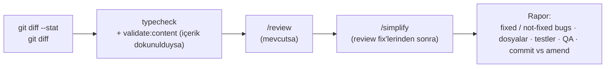

# Codex Review Workflow

<!-- gh-toc -->

## İçindekiler

- [Executive Summary](#executive-summary)
- [Why It Exists](#why-it-exists)
- [Current Canon](#current-canon)
- [How It Works](#how-it-works)
- [Failure Modes](#failure-modes)
- [Examples](#examples)
- [Runtime Implementation](#runtime-implementation)
- [Known Gaps](#known-gaps)
- [Open Questions](#open-questions)
- [Decision History](#decision-history)
- [Related Notes](#related-notes)

> [!canon] Purpose — Değişikliği **yazmayan** bağımsız bir gözün (Codex) diff'i nasıl gözden geçirdiği: bug bulma, sadeleştirme, review-then-commit kapısı.

## Executive Summary

Codex = **independent reviewer** — kod yazmaz, sadece review eder ve *review ettiği değişikliği yazmamıştır* (bağımsızlık şartı). Post-implementation review, kod değiştikten sonra `git diff` + `/review` + `/simplify` (mevcutsa) ile çalışır ve raporlar: bulunan buglar (fix'li/fix'siz), değişen dosyalar, testler, manuel QA checklist, önerilen commit mesajı ve **commit mi amend mi** olması gerektiği. Codex commit atmaz; **commit'i kullanıcı review'ı kontrol eder.**

## Why It Exists

Implementer kendi kodunu onaylayamaz. Codex, tek-yönlü doğrulamayı kırar: farklı bir ajanın diff'e bakması gizli bug'ları ve gereksiz karmaşıklığı yakalar. Loop-audit dokümanları (2026-07-08 / 07-09) bu bağımsız çok-lensli review'ın ürünü — B1–B24 ve C1–C30 bulguları oradan geldi ([[Incident and Blocker Handling]]).

## Current Canon

> [!canon] **Bağımsızlık:** Codex, review ettiği değişikliği yazmamıştır (Agent Constitution §1). Yalnızca review yapar; app-kodu edit'i, merge, build, deploy Codex'in işi değildir.

### Post-implementation review adımları (MASTER_PIPELINE §13)

Rapor **tam olarak** şunları döndürür: (1) bulunan ve düzeltilen buglar, (2) bulunan ama düzeltilmeyen buglar, (3) değişen dosyalar, (4) geçen/kalan testler, (5) manuel QA checklist (**operator-only** öğeleri işaretli), (6) önerilen commit mesajı, (7) onaydan sonra bu **commit mi amend mi** olmalı, (8) Skill substitutions (cloud), (9) Sync Queue items (cloud). **Do not commit yet.**

### Review-then-commit kapısı

> [!canon] Review commit'i kontrol eder — implementasyon sonrası otomatik commit YOK.
> - `devam` / `onaylandı` / `commit` → onaylanan adımı commit'le.
> - `Concern` / `Öneri` / `şunu düzelt` → aynı adımı yamala; feedback aynı mantıksal adıma aitse önceki commit'i **amend** et, gürültülü yeni commit açma.
> - Feedback yeni bir mantıksal scope yaratıyorsa → önce yeni step spec, sonra kod.

## How It Works
### Inputs
Claude'un ürettiği diff + [[Claude Code Workflow]] raporu; `git diff`; ilgili validasyon çıktıları.
### Outputs
Yapılandırılmış review raporu (yukarıdaki 9 madde). Merge/commit/deploy önerisi verir ama **uygulamaz**.
### Main Rules
- LM-3+ işlerde PR'dan önce `/review` sonra `/simplify` (bug bulma önce, kalite sonra — ayrı işler).
- Bulunan ama düzeltilmeyen buglar açıkça listelenir (dürüst statü); "proposed" asla "done" değildir.
### Guardrails
Cloud'da mevcut olmayan review skill'i → düz akıl yürütmeyle ikame + raporda "Skill substitutions".

## Failure Modes
- **Reviewer değişikliği kendisi yazmışsa** → bağımsızlık ihlali; review geçersiz.
- **Concern gelince yeni commit açmak** → gürültülü history; kural amend'i tercih eder.
- **Bulunan bug'ı sessizce yutmak** → yasak; not-fixed listesinde görünmeli.

## Examples
> [!example]
> 2026-07-09 loop audit v2: `main @ 4b68f4c` üzerine 8 paralel lens; 5 tamamlandı, 4 session-cap ile öldü ama convergence ile kapsandı. B1–B24'ten 15'i fix'li olarak doğrulandı, kalanlar (B5/B10/B13/B14/B17/B18/B20/B24) açık bırakıldı — hiçbir fix uygulanmadı, sadece severity-ranked PR-H…PR-O sırası önerildi.

## Runtime Implementation
### Code References
Süreç kanonu. Somut çıktı örnekleri: `docs/audits/2026-07-08-final-loop-audit.md`, `docs/audits/2026-07-09-loop-audit-v2.md`.
### Product-Stage Availability
Tüm stage'lerde bağlayıcı.

## Known Gaps
- Codex rolü çoğunlukla loop-audit'lerle **partial** olarak icra edildi; her PR'da rutin bir Codex kapısı henüz mekanize değil (insan/ajan review'a bağlı).

## Open Questions
> [!open-loop] Round 1 için PR #174 Haktan screen-review verdict + operator smoke hâlâ bekliyor; #180 device-pass'e bağlı. → [[05 Open Loops]]

## Decision History
- İki loop-audit (2026-07-08 saturated; 2026-07-09 v2) bağımsız review'ın ürünü. PR-E slice complete (B7/B12 #193; B8/B23 #194).

## Related Notes
[[Claude Code Workflow]] · [[Development Workflow]] · [[PR Discipline]] · [[Validation Gates]] · [[Incident and Blocker Handling]] · [[00 Le Mot Holy Codex]]
