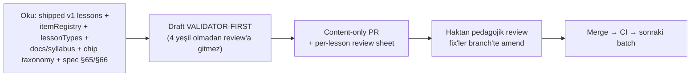

# Content Production Workflow

<!-- gh-toc -->

## İçindekiler

- [Executive Summary](#executive-summary)
- [Why It Exists](#why-it-exists)
- [Current Canon](#current-canon)
- [Failure Modes](#failure-modes)
- [Examples](#examples)
- [Runtime Implementation](#runtime-implementation)
- [Known Gaps](#known-gaps)
- [Open Questions](#open-questions)
- [Decision History](#decision-history)
- [Policy Hardening — Required Authoring Ledger (2026-07-18)](#policy-hardening-required-authoring-ledger-2026-07-18)
- [Related Notes](#related-notes)

> [!canon] Purpose — Kalan Cairn derslerinin nasıl üretildiği: **CONTENT_FACTORY_CONTRACT** (Faz 6A) + **Training Content Factory** (deriveDrill, practice selector). Batch-küçük, validator-first, Haktan-review'lı.

## Executive Summary

`CONTENT_FACTORY_CONTRACT` (v0.1, 2026-07-02) kalan ~174 dersin üretim kontratıdır. **Batch birimi bir Unit dilimidir, asla tüm syllabus** — varsayılan 3 ders (pilot), kanıtlandıkça ~6'ya kadar. Bir batch = bir content-only PR = bir Haktan pedagojik review. Authoring loop **VALIDATOR-FIRST**: typecheck/validate:content/validate:pools/test:learning-engine kırmızı olan taslak review'a ulaşmaz. Çıktı `lesson-XXX.ts` (mevcut schema, uydurma alan yok) + her yeni itemId için `itemRegistry` eklemesi + `V1_LESSONS` kaydı. Ayrıca **Training Content Factory**: hub egzersizleri elle yazılmaz, **deriveDrill** ile deterministik türetilir; ne göstereceğine **practice selector v0** karar verir. İlk pilot **L7–L9 ONLY** (LOCKED).

## Why It Exists

Elle yazılan statik egzersizler ~80 lessona ölçeklenmez (D-25). Ayrıca içerik, cümle ezberine kaymadan (whole-first → use → notice → unpack → reuse) ve recycle'ın dersi çalmasına izin vermeden üretilmeli. Kontrat, bu pedagojik kuralları **makine-checked lint** + **insan-checked review** olarak ikiye böler.

## Current Canon

### Batch policy (§1.1)
> [!canon] Batch = Unit dilimi, ASLA tüm syllabus. Default 3 ders (pilot), ~6'ya kadar. Bir batch = bir content-only PR = bir Haktan review. **Kalan ~174 dersi tek seferde üretme.** Batch'ler sıralı, asla paralel.

### Authoring loop (§1.2)

### İçerik kuralları (§1.5, hard)
- **Full-sentence chip yok** `piecesUsed`'da (CI lint); cümle ezberi yok.
- Recycle dersi çalamaz: **target share ≥ 0.50**, görünür carryover ≤ 3, recycled ≤ 2/cümle, exposure ≤ 2/unit, weak ≤ 1. *(Bu cap'ler için tek kanonik değer + sınıflandırma evi: [[Difficulty and Cognitive Load]]; burada CPW lint enforcement olarak yer alır.)*
- Passive/ghost exposure ≤ 2, asla correctness için gerekli değil, asla `piecesUsed`'da.
- Doorway/compact ders için 1–2 aktif-yeni chip; ≤ 1–2 micro-logic kartı (yalnızca yeni görülen materyale bağlı).
- **Weave prompt'ları directive/intent-based** ("Say you are heading home") + soru yanıtları için no-question-mark alternatifi (CI-enforced).
- Model answers = doğal Fransızca, tam cümle **yalnızca orada**, asla auto-chip.
- `oui` explicit aktif öğretilmedikçe recognition/passive kalır.
- itemId'ler stabil kebab (`chunk-je-vais`, `prefix:slug` DEĞİL), sessiz rename yok (YASA 2).
- TTS string'leri tam sözlü Fransızca, placeholder yok (CI-enforced).

### Gate before review (§1.6)
Dört yeşil: `typecheck`, `validate:content`, `validate:pools`, `test:learning-engine` ([[Validation Gates]]).

### İlk pilot (§2, LOCKED)
> [!canon] **L7–L9 ONLY** — tüm Unit 2 değil, 174 ders değil. L7 kabul edilen compact doorway spec'ini izler (`docs/syllabus/L07-compact-doorway.compact-spec.md`) — frozen-chunk doorway, tam iki yeni item. `V1_LESSONS`'a kayıtlı ama Home L6-cap'te → ayrı bir smoke-bearing unlock PR cap'i yükseltene dek runtime-invisible. Haktan review'sız asla merge edilmez.

### Training Content Factory (deriveDrill + selector)
- **deriveDrill** (fail-closed) — item + screen-type template → deterministik üretim ("bu chip'i bir fill formuna dök"), elle yazılmış statikler yerine (D-25, #179).
- **practice selector v0** — canon 5.2 order: SRS-due → weakest tag → upcoming integration need → variety. **Evidence weight** (mastery çarpanı) ile **selection weight** (bugün ne gösterilecek) ayrı modüller, asla karışmaz.

### Payload Economy pointer (§7)
Item-katmanı kararları `docs/PAYLOAD_ECONOMY_v0.md` (locked 2026-07-04): her adayı eklemeden önce **engine/payload/ghost/pool** olarak sınıflandır. NEW closed **survival-formula** class (`je ne comprends pas`, `vous pouvez répéter ?`); `PROTECTED_CHUNKS` 2'de frozen; `oui` producible ANSWER olarak rehabilite.

## Failure Modes
- **Tek-shot generation** → kalan 174 dersi bir PR'a; yasak, batch sıralı olmalı.
- **Recycle dersi çalması** → target-share < 0.50 veya carryover > 3; lint yakalar.
- **Full-sentence chip** `piecesUsed`'a girerse → CI lint hard error.
- **Placeholder TTS** → CI-enforced fail.

## Examples
> [!example]
> **Weave prompt (doğru):** *"Say you are heading home."* → öğrenci `je vais ... à la maison` iskeleti kurar, bilmediğini İngilizce bırakır. Soru yanıtı gerekiyorsa no-question-mark alternatifi CI ister.
> **L6 Un petit moment** (`abb0b10`) — integration payoff, L1–L5'i recombine eder, +`chunk-au-revoir`, "au revoir" kapanışı.

## Runtime Implementation
### Code References
`lemot-app/content/lessons/v1/` (16 dosya lesson-000..015), `lemot-app/content/itemRegistry.ts`, `lemot-app/content/lessonTypes.ts` (7 frozen screen type), deriveDrill + selector (#179, `691cde3`).
### Test References
`lemot-app/content/learning-engine/*`; `round1ContentContracts.test.ts` (screen-count contract, final layout'a karşı bir kez güncellenir).
### Product-Stage Availability
Üretim tüm stage'lerde; L7–L15 kayıtlı ama dev-apk Home L6-cap'te gizli.

## Known Gaps
- Pilot henüz loop'u kanıtlamadı (L7–L9); Home L6-cap unlock PR'ı gerekli (KNOWN_GAPS #3).
- Telemetry v0 (§4) local-only, content debugging; NO RAW LEARNER FREE-TEXT; telemetry mastery'yi ASLA güncellemez.

## Open Questions
> [!open-loop] deriveDrill K6 tone-pass Taş 2 / PR 14'e deferred. → [[05 Open Loops]]

## Decision History
- Content Factory Contract v0.1 (`0371e10`, #172 civarı). Pilot L7–L9 LOCKED. deriveDrill Option B (#179). Payload Economy v0 (`0b31c69`).

## Policy Hardening — Required Authoring Ledger (2026-07-18)

> [!canon] **PRIMARY POLICY HOME** for the per-lesson **item-role + mechanics ledger** her gelecek ders spec/review sheet'inde zorunludur. Alan tanımları/roller [[Chip Taxonomy]]'de; sayım/formül [[Difficulty and Cognitive Load]]'ta; horizon [[Chip Lifecycle]]'te; error/repair [[Error Tracking System]]'de. Sınıf: **[LOCKED DEFAULT]**.

### Per-item alanları (zorunlu)

`itemId` · `surface` · `firstIntroducedIn` · `roleThisLesson` · item/chip type · `productionEligibility` · `recognitionEligibility` · `exposureOnly` · `carryoverWindow` · `plannedNextUses` · `reasonForReturn` · `errorTagEligibility` · `budgetClass` · `cutoffRule` · `reactivationTriggers` · `expectedPostLessonState`

### Per-lesson alanları (zorunlu)

`lessonArchetype` · `communicativePromise` · `spine` · `activeNewCount` · `supportedTargetCount` · `productionCarryoverCount` · `recognitionCarryoverCount` · `repairReserveUsed` · `integrationTargetCount` · `exposureCount` · `totalProductionLoad` · `targetLoadShare` · `carryoverPlan` · `exposurePlan` · `evidenceMap` · `errorRepairMap` · `exitCondition` · `validatorStatus` · `founderReviewStatus` · `FrenchQAStatus`

### Anti-gaming rule [HARD INVARIANT]

Bir ders, fazla eski üretim yükünü `supportedTarget` / carryover / repair / integration kovalarına **saklayarak** `activeNew` bütçe kontrolünü **geçemez.** `totalProductionLoad` formülü ([[Difficulty and Cognitive Load]]) ve `targetLoadShare ≥ 0.50` bunu yakalamak içindir; CPW lint `carryover > 3` ve `target-share < 0.50`'i build-time işaretler.

### Non-claims

- Ledger bir **authoring/review gereksinimidir**; **runtime validator değildir**. **Mevcut derslerin hiçbirinin bu ledger'a uyduğu iddia edilmez** — retro-audit + ledger geriye-doldurma ayrı bir gelecek görevdir. `FrenchQAStatus` alanı native QA'nın **yapıldığını iddia etmez** ([[French Linguistic QA]] gate OPEN).

## Related Notes
[[Validation Gates]] · [[Syllabus Production Workflow]] · [[Self-Producing Engine]] · [[Content Selection]] · [[PR Discipline]] · [[Documentation Workflow]] · [[French Linguistic QA]] (anadili dil-QA kapısı — süreç OPEN) · [[Chip Taxonomy]] · [[Difficulty and Cognitive Load]] · [[Lesson Anatomy]] · [[00 Le Mot Holy Codex]]
