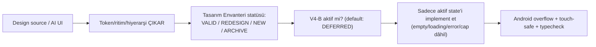

# Design Production Workflow

<!-- gh-toc -->

## İçindekiler

- [Executive Summary](#executive-summary)
- [Why It Exists](#why-it-exists)
- [Current Canon](#current-canon)
- [How It Works](#how-it-works)
- [Failure Modes](#failure-modes)
- [Examples](#examples)
- [Runtime Implementation](#runtime-implementation)
- [Known Gaps](#known-gaps)
- [Open Questions](#open-questions)
- [Decision History](#decision-history)
- [Related Notes](#related-notes)

> [!canon] Purpose — Cairn'de görsel/UI işinin nasıl üretildiği: token'lardan çalış, AI-üretimi tasarımı **çıkar (extract), yapıştırma**, **V4-B DEFERRED** kuralına saygı.

## Executive Summary

Cairn tasarımı **premium, sakin, insani, dağ-patikası** hissi taşır — "bir notu okumak nabzı düşürmeli". Palette kod içinde canonicaldır (`lemot-app/constants/theme.ts` `P` objesi, `tailwind.config.js` `lm` namespace'ine ayna). Fontlar Newsreader (serif/Fransızca) + Outfit (sans/UI). **Gamification tasarım kimliğidir, zevk değil**: XP/streak/level-up/reward dili canon-wide FORBIDDEN. Kritik iş kuralı: **V4-B "asymmetrical breath" SEÇİLDİ ama global redesign DEFERRED** — Dev APK smoke / internal-test feedback'e kadar, açıkça reaktive edilmedikçe. Alakasız işe V4-B token refactor'ü **sokulmaz** (Rule 9).

## Why It Exists

Design source (V4 Studies spec / standalone HTML / source JSX) **otomatik olarak implementation scope değildir** (MASTER_PIPELINE §2). AI-üretimi UI ham yapıştırılırsa (production'da) Cairn'in sakin premium hissini bozar; token/ritim/hiyerarşi çıkarılır, ham paste yalnızca pre-canon keşif prototiplerinde.

## Current Canon

### Palette ve fontlar (IMPLEMENTED)
`P` objesi: `bg #FAF9F7` (parchment), `paper #FFFFFF`, `ink #2C2825` (asla saf `#000`), brick `red #C0392B`, `green #27AE60`, `amber #E67E22`, `purple #7C3AED`, `border #E8E5E1`. Dört-accent hikâyesi CLAUDE.md convention'ıyla eşleşir. Fontlar `app/_layout.tsx`'te yüklenir. Cairn = trail-marker markası ([[Cairn Brand Direction]]).

### Non-gamification (kodda enforce)
> [!canon] `theme.ts` `MOTIV` rotation: reward/cheerleader/pressure tonları **kasıtla yok** (no XP, no streak, no "keep going", no "great job"). Ton = **passive mirror** — öğrencinin yanına otur, itme. String'ler Fransızca proverb + soft reflection ("You are not behind. You are on the path."). Bu ürün kimliğidir (D-01/D-02).

### V4-B disposition
> [!warning] **V4-B seçildi, DEFERRED.** Global V4-B redesign Dev APK smoke / internal-test feedback'e kadar bekler. **Reaktivasyon sinyali:** yalnızca kullanıcı açıkça "V4-B implementation'ı aç/başlat" derse. Ajanlar V4-B token refactor'ünü alakasız işe sokmaz (Rule 9). Detay: [[V4 Studies Disposition]].

### Extract-not-paste
> [!canon] AI-generated UI: token, ritim, hiyerarşi, spacing, interaction fikirlerini **çıkar**. Ham paste yalnızca pre-canon discovery prototiplerinde; production'a adaptasyon olmadan asla.

## How It Works

### Inputs
Design source, Tasarım Envanteri classification (repo'da yoksa Sync Queue), palette token'ları.
### Outputs
Aktif-state UI; screenshot/manual QA (operator-only in cloud).
### Guardrails (Le Mot design checks)
Premium calm; no gamey reward language; typography breathable; error states neutral; V4-B asimetrisi yalnızca V4-B aktif scope iken; touch targets mobile-safe; offline/empty/cap states designed. **Web `next/image` uyarısı:** `fill` prop'unu kırılgan `position:absolute` container'da parent sizing açık/test edilmedikçe kullanma.

## Failure Modes
- **V4-B'yi alakasız PR'a kaçırmak** → Rule 9 ihlali (stale trap).
- **Ham AI UI paste** → Cairn hissi bozulur; extract şart.
- **Reward/streak dilinin geri sızması** → D-01 ihlali; copy-guard yakalar.

## Examples
> [!example]
> Obsidian customization draft'ı (`lemot-obsidian-customization-v0.md`) semantic token'ları app palette'ine bağlar: `--lm-summit` (active canon; green desatüre), `--lm-trail` (draft; amber), `--lm-campfire` (review/paywall; ember), `--lm-fog` (open question; slate). On custom callout tavanı 10. Bu, tasarım dilinin vault'a taşınmış hâli — aynı extract-not-paste prensibi.

## Runtime Implementation
### Code References
`lemot-app/constants/theme.ts` (`P`, `MOTIV`), `lemot-app/tailwind.config.js` (`lm-*` namespace, `fontFamily.newsreader`/`outfit`), `lemot-app/app/_layout.tsx` (font loading).
### Product-Stage Availability
Palette/tone tüm stage'lerde; V4-B global redesign hiçbir stage'de aktif değil (DEFERRED).

## Known Gaps
- V4-B global implementation bekliyor; Tasarım Envanteri (155 screen/state) operator-vault'ta — cloud'da tam okunamaz.
- `android_ui_verification` = operator-only in cloud.

## Open Questions
> [!open-loop] V4-B reaktivasyonu Dev APK smoke / internal-test feedback'ine bağlı. → [[05 Open Loops]]

## Decision History
- V4-B selected but deferred (Rule 9). Palette/font CANONICAL (theme.ts). Non-gamification LOCKED (D-01/D-02).

## Related Notes
[[Design System Overview]] · [[Cairn Brand Direction]] · [[V4 Studies Disposition]] · [[Copy and Tone]] · [[Accessibility]] · [[Development Workflow]] · [[00 Le Mot Holy Codex]]
