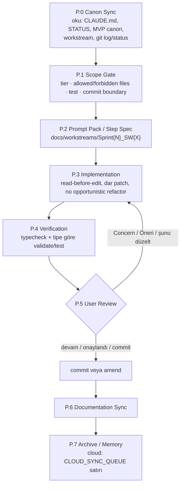

# Development Workflow

<!-- gh-toc -->

## İçindekiler

- [Executive Summary](#executive-summary)
- [Why It Exists](#why-it-exists)
- [Current Canon](#current-canon)
- [How It Works](#how-it-works)
- [Failure Modes](#failure-modes)
- [Examples](#examples)
- [Runtime Implementation](#runtime-implementation)
- [Known Gaps](#known-gaps)
- [Open Questions](#open-questions)
- [Decision History](#decision-history)
- [Related Notes](#related-notes)
- [🧭 GitHub Navigation](#-github-navigation)

> [!canon] Purpose — Cairn'de her kod/karar işinin izlediği tek resmî boru hattı: **Canon önce, skill sonra, kod en son.** Bu not, `docs/MASTER_PIPELINE_v1.2.1.md`'nin canonical vault evidir.

## Executive Summary

Le Mot / Cairn geliştirme akışı `MASTER_PIPELINE v1.2.1` tarafından yönetilir. Temel prensip üç kelimede: **Canon önce gelir. Skill sonra gelir. Kod en son gelir.** Her görev bir **tier** (LM-1..LM-5) ile sınıflandırılır, **canon precedence** ile hangi belgenin kazandığı belirlenir, **P.0–P.7 faz döngüsünden** geçer ve **review-then-commit** disipliniyle kapanır. Cloud oturumları Obsidian/mempalace yazamaz — bunun yerine `docs/CLOUD_SYNC_QUEUE.md`'ye satır ekler. Operator-only blocker'lar açıkken hiçbir sprint "done" ilan edilemez.

## Why It Exists

Sorun daha fazla skill değildi; **daha iyi routing, daha net canon precedence, daha küçük PR'lar, daha disiplinli QA ve legacy ile aktif kanonun asla karışmaması** idi (MASTER_PIPELINE §0). Pipeline bir **trafik kontrolörüdür**, bir araç kataloğu değil. Kaynağı: repo `docs/` üç kopuk dokümantasyon evi + iki paralel syllabus çelişkisi taşıyordu ([[Obsidian to Git Promotion Rules]] ve redesign planına bakınız).

## Current Canon

> [!canon] **Canon precedence (çakışmada yeni aktif kazanır).**
> `CLAUDE.md → docs/STATUS.md → docs/DEV_APK_MVP_CANON.md → Cairn v1.0 spec`.
> Genel kural: **newer active > current codebase > older active > design reference > archive.** Her promptta: *"If any source conflicts, active canon wins. Do not revive legacy decisions unless explicitly requested."*

**Stale trap'ler (aktif sanılmamalı):** Merged Product Canon 2026-05-11 top-level canon DEĞİL; `SPRINT_11_PLAN.md` ve "Sprint 10/11/12" dili bayat — `docs/STATUS.md` tek sprint-durum kaynağı; V4-B global redesign DEFERRED; 24-lesson/L14-paywall/11-section akışı SUPERSEDED. Bkz. [[06 Canon and Status Legend]].

### Tier sistemi (LM-1 … LM-5)

| Tier | Ne | Zorunlu adımlar |
|---|---|---|
| **LM-1** Micro copy / tiny UI | Tek string/style/typo; yasak kelime düzeltme | Tek satır + saf literal ise doğrudan patch; mantığa dokunursa `/simplify` |
| **LM-2** Small bug / one component | Tek component state/style fix | `/simplify`, `typecheck`, dar patch |
| **LM-3** Feature slice / PR-sized | Yeni ekran/mekanik dilimi | Workstream step spec → plan → patch → `/review` → `/simplify` → review → commit |
| **LM-4** Canon / design / architecture | Motor refactor, schema, paywall mimari | Graph/impact → canon audit → 2–5 PR'a böl → sıralı çalıştır |
| **LM-5** Product phase / release | Dev APK / beta / release | Milestone def → scope freeze → security/QA checklist → build (operator) |

> Away-agent otonomisi yalnızca **LM-1/LM-2**'dir; LM-3+ attended oturum gerektirir ([[Agent Collaboration]]).

## How It Works

### The P.0–P.7 phase loop

Her **SW.X** (sprint workstream) birden çok task içerebilir; **her task P.0–P.7'yi bağımsız** yürütür. `P.0–P.7` = pipeline fazları; `SW.1–SW.X` = sprint iş kolları — ikisi karıştırılmaz.

### Inputs
Aktif canon dosyaları (CLAUDE.md, STATUS, DEV_APK_MVP_CANON, ilgili workstream), `git status --short`, `git log -1`, ilgili kaynak dosyalar.

### Outputs
Dar bir diff, geçen validasyonlar, bir review raporu (Summary / Files changed / Tests / Manual QA / Risks / Skill substitutions / Sync Queue / Suggested commit), onaydan sonra bir conventional commit.

### Main Rules
- **One PR = one product intention** (detay: [[PR Discipline]]).
- **Review controls commit** — implementasyon sonrası otomatik commit yok. `devam`/`onaylandı`/`commit` → commit; `Concern`/`Öneri`/`şunu düzelt` → aynı adımı yamala, uygunsa önceki commit'i **amend** et.
- **Karpathy house rules bağlayıcı:** think-before-coding, simplicity-first, surgical changes, motor saflık kontratı (bkz. [[Claude Code Workflow]] ve `docs/engineering/karpathy.md`).
- **No canon-free coding**, **no broad refactor inside a feature PR**, **no deprecated-language revival** (XP/streak/level up/achievement/amazing/perfect score).

### Guardrails (Cloud Mode Addendum)
> [!warning] Cloud / Web / CI oturumu isen:
> 1. `~/Desktop/...` veya Obsidian vault yollarını **okuma/yazma**. Operatör referansı olarak bırak.
> 2. mempalace MCP çağırma (bağlı değil).
> 3. Mevcut değilse GSD komutlarını atla; eşdeğer içeriği düz markdown ver.
> 4. Eksik skill → düz akıl yürütmeyle ikame et, raporda **"Skill substitutions"** başlığında belirt.
> 5. Kalıcı karar/canon güncellemesi → `docs/CLOUD_SYNC_QUEUE.md`'ye satır (Obsidian/mempalace yazma yerine).
> 6. EAS / Supabase deploy / secrets / APK rebuild / fiziksel smoke = **Operator-only**.
> 7. **Operator blocker açıkken cloud "complete/shipped/done" diyemez** (Rule 11) — sadece "code-side ready".
> 8. GitHub yalnızca `mcp__github__*` ile (gh/hub yok).

## Failure Modes

- **Canon-free coding** → yanlış (legacy) syllabus'e göre kod; en pahalı hata modu. Önlem: P.0 zorunlu.
- **Scope smuggling** → tek PR'a birden çok niyet; reviewer diff'i kafasında tutamaz. Önlem: [[PR Discipline]].
- **Yasak dil geri sızması** → copy guard'lar (#101/#110) yakalar; audit checklist'i doğrular.
- **Cloud'da vault yazma girişimi** → MASTER_PIPELINE ihlali; Sync Queue'ye satır atılmalı.

## Examples

> [!example]
> **İyi PR:** *"Add one-time How Weave Works interstitial"* — tek niyet.
> **Kötü PR:** *"Update lesson flow, fix TTS, redesign Daily Review, clean docs"* — dört niyet, reddedilir.

> [!example]
> Bir cloud oturumu L16 Integration spec'ini kilitledi. Vault'a yazamaz; bunun yerine: (a) repo `docs/syllabus/`'a spec ekler (PR), (b) `docs/CLOUD_SYNC_QUEUE.md`'ye `Status: PENDING` satırı ekler → operatör Obsidian/mempalace'i sonra drain eder. Bu tam olarak [[Obsidian to Git Promotion Rules]] akışının ters yönüdür.

## Runtime Implementation
### Code References
Bu bir süreç kanonudur; runtime kodu yoktur. Uygulama noktası: `docs/MASTER_PIPELINE_v1.2.1.md` (auto-loaded via `@` in `CLAUDE.md`), `docs/workstreams/` (step spec'ler), `docs/CLOUD_SYNC_QUEUE.md`.
### Product-Stage Availability
Tüm stage'lerde bağlayıcı (sandbox / dev-apk / public-beta).

## Known Gaps
- **v1 Locked Canon / TOP CANON** operator-vault'ta, uncommitted — cloud okuyamaz. En büyük keşfedilebilirlik açığı. Bkz. [[Obsidian to Git Promotion Rules]].
- Operator-vault "Test Checklist.md" ile repo `DEV_APK_SMOKE_TEST_CHECKLIST.md` yinelenen çift; Round 1 için repo kopyası kazanır.

## Open Questions
> [!open-loop] Pipeline versiyonu bump olduğunda `CLAUDE.md` `@` referansı + repo dosya adı güncellenmeli; operatör local mirror'ı senkronlar. → [[05 Open Loops]]

## Decision History
- MASTER_PIPELINE v1.2 → v1.2.1 patch (path standardı, Test Checklist path, `/gsd:progress` bootstrap'a taşındı, operator-blocker uyarısı). Cloud-adaptation patch (Cloud Mode Addendum, Rule 11).
- Karpathy import (K4, 2026-07-05) — engine-purity kontratı bağlayıcı.

## Related Notes
[[Claude Code Workflow]] · [[Codex Review Workflow]] · [[PR Discipline]] · [[Validation Gates]] · [[Agent Collaboration]] · [[Documentation Workflow]] · [[Incident and Blocker Handling]] · [[00 Le Mot Holy Codex]]

<!-- gh-nav -->

## 🧭 GitHub Navigation

[⬆ README](../../README.md) · [🪨 Holy Codex](../00_START_HERE/00%20Le%20Mot%20Holy%20Codex.md) · [Current State](../00_START_HERE/03%20Current%20State.md) · [Open Loops](../00_START_HERE/05%20Open%20Loops.md)

**Bu klasördeki notlar (10_OPERATIONS):**

- [Agent Collaboration](./Agent%20Collaboration.md)
- [Claude Code Workflow](./Claude%20Code%20Workflow.md)
- [Codex Review Workflow](./Codex%20Review%20Workflow.md)
- [Content Production Workflow](./Content%20Production%20Workflow.md)
- [Design Production Workflow](./Design%20Production%20Workflow.md)
- [Development Workflow](./Development%20Workflow.md) ⟵ *bu not*
- [Documentation Workflow](./Documentation%20Workflow.md)
- [Incident and Blocker Handling](./Incident%20and%20Blocker%20Handling.md)
- [Obsidian to Git Promotion Rules](./Obsidian%20to%20Git%20Promotion%20Rules.md)
- [PR Discipline](./PR%20Discipline.md)
- [Syllabus Production Workflow](./Syllabus%20Production%20Workflow.md)
- [Task Context Packs](./Task%20Context%20Packs.md)
- [Validation Gates](./Validation%20Gates.md)
