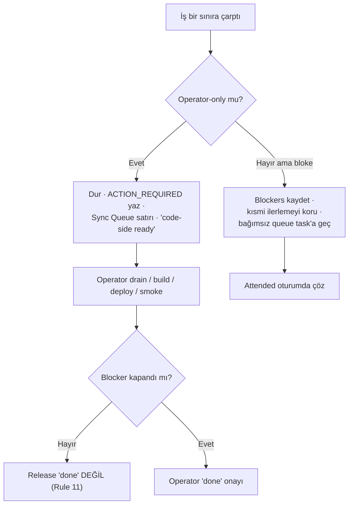

# Incident and Blocker Handling

<!-- gh-toc -->

## İçindekiler

- [Executive Summary](#executive-summary)
- [Why It Exists](#why-it-exists)
- [Current Canon](#current-canon)
- [How It Works](#how-it-works)
- [Failure Modes](#failure-modes)
- [Examples](#examples)
- [Runtime Implementation](#runtime-implementation)
- [Known Gaps](#known-gaps)
- [Open Questions](#open-questions)
- [Decision History](#decision-history)
- [Related Notes](#related-notes)

> [!canon] Purpose — Bir iş **bloke olduğunda** ne yapılır; **operator-only blocker'lar** nelerdir; ve **"code-side ready" ile "done" arasındaki kural** (cloud asla operator blocker'ı susturmaz — Rule 11).

## Executive Summary

Cairn'de bloke olmak sessizce yutulmaz: ajan **durur**, `## Blockers` + `## ACTION_REQUIRED` kaydeder, kısmi ilerlemeyi korur, queue'yu yalnızca bağımsızsa ilerletir. Bazı işler doğası gereği **operator-only**'dır (EAS build, Supabase deploy, secrets, fiziksel device smoke, APK rebuild, branch delete) — cloud bunları çalıştıramaz. **Rule 11 (kritik):** cloud "code-side ready" diyebilir ama **herhangi bir operator blocker açıkken "complete/shipped/done" DİYEMEZ.** Sistematik hatalar iki loop-audit ile (B1–B24, C1–C30) taranmış, severity-ranked PR sırasına (PR-A…PR-O) bağlanmıştır.

## Why It Exists

Yanlış yüzeyi tester'a shipping etmek görünmez bir hatadır; local-first veri kaybı geri alınamaz. Cloud ajanı build/deploy/fiziksel-test yapamadığı için bir release'i tek başına "done" ilan ederse operatörü yanıltır. Blocker disiplini, dürüst statüyü zorlar: kod hazır olabilir ama ürün operatör onayı olmadan "bitti" değildir.

## Current Canon

### Bloke olunca (Agent Constitution §5)
> [!canon] Dur. `## Blockers` + `## ACTION_REQUIRED` kaydet. Kısmi ilerlemeyi koru. Queue'yu yalnızca bağımsızsa ilerlet. **Asla sessizce yutma.** Rapor (`.agent-runs/...`) "Not done by rule" bölümüyle dürüst statü verir; "proposed" asla "done" değildir ([[Agent Collaboration]]).

### Operator-only blocker'lar (cloud kapatamaz)
| Blocker | Neden operator-only |
|---|---|
| Fiziksel device founder/tester smoke | Cloud fiziksel cihaza dokunamaz |
| EAS preview build + `EXPO_PUBLIC_SUPABASE_*` env | EAS CLI + Dashboard operatörde |
| Supabase Edge Function deploy + secrets verify | Supabase Dashboard/secrets operatörde |
| Schema migration apply (schema-file ≠ deployed DB) | Deployed DB'ye yazma operatörde |
| G3 Supabase email-confirmation re-enable | Env-bearing tester build öncesi P0 |
| Stale merged `claude/*` branch cleanup | Cloud git proxy delete-push 403 |
| CLOUD_SYNC_QUEUE PENDING rows drain | Obsidian/mempalace operatörde |
| APK rebuild / install | Operatör makinesi/cihazı |

### Rule 11 — code-side ready ≠ done
> [!warning] Cloud **"code-side ready"** diyebilir. Cloud, herhangi bir operator blocker (APK rebuild, EAS env push, Supabase deploy, secrets verify, fiziksel smoke, build ID record) açıkken **"complete", "shipped", "done" DİYEMEZ.** Bir release cloud'da "done" değildir.

### Golden rule of screenless work
Görülmemiş UI davranışı asla merge edilmez; `[awaiting device pass]` etiketli branch'te bekler (D-38; #180 natural-reveal böyle açık tutuldu). Device-day evening hardening paketi bir **ön koşul değildir** — yarım kalsa da device test yapılır (DEVICE_DAY runbook guardrail).

## How It Works

### Sistematik incident taraması (loop audits)
- **2026-07-08 final loop audit** — 20-lens review, 286 dosya, 2 tur; 24 bulgu **B1–B24** (HIGH: B1 double-count, B2 lm7 corrupt→silent reset, B3 event-log corrupt→destroyed, B4 açık LLM relay [latent], B22 unvalidated content). Sadece **PR-A (B2+B3 data-loss hardening)** uygulandı; kalanı PR-A…PR-G sırasına bağlandı.
- **2026-07-09 loop audit v2** — `main @ 4b68f4c`; B1–B24'ten **15 fixed** (#188–#194), açık: B5/B10/B13/B14/B17/B18/B20/B24. Net-new **C1–C30** (HIGH: C1 cloud-delete yok, C2 `__corrupt` blob PII orphan, C3 edge validation test'siz, C4 cloud-merge untested). Severity-ranked **PR-H…PR-O**; PR-H/#196 landed. Scorecard **B+**.

## Failure Modes
- **Blocker'ı sessizce yutmak** → yasak; ACTION_REQUIRED şart.
- **Cloud'un "done" demesi** (blocker açıkken) → Rule 11 ihlali; en tehlikeli operasyonel yalan.
- **Wrong-order device-day landing** → K2 sırası bozulursa zincir durur (partial OK, wrong-order değil).
- **Corrupt storage'ı silmek** → B2/B3; non-destructive quarantine ile düzeltildi (#188, PR-A).

## Examples
> [!example]
> Round 1 L0–L6 runtime `8cefe81` (#136)'da emülatör smoke ile KABUL & FROZEN, P0–P3 sıfır. Ama **fiziksel device smoke + EAS build hâlâ operator-only ve bekliyor.** Cloud bu yüzden "Round 1 done" diyemez — yalnızca "code-side ready, awaiting operator". Rebuilt Lesson Zero (#139) operatör device smoke'unda yeniden kapsanmalı.

## Runtime Implementation
### Code References
Süreç kanonu. Kanıt: `docs/audits/2026-07-08-final-loop-audit.md`, `docs/audits/2026-07-09-loop-audit-v2.md`, `docs/runbooks/DEVICE_DAY.md`, `docs/STATUS.md` (open blockers), `.agent-runs/` (raporlar).
### Product-Stage Availability
Tüm stage'lerde bağlayıcı.

## Known Gaps
- Açık B-serisi (B5/B10/B13/B14/B17/B18/B20/B24) ve C-serisi (C1 cloud-delete, C3/C7/C13 edge guards, C14 Android backup opt-out) PR-H…PR-O'da sıralı, çoğu operator DB / `aiEnabled` flip'ine bağlı.
- v1 pedagogy lint yok (KNOWN_GAPS #5).

## Open Questions
> [!open-loop] Tam operator blocker listesi ve drain durumu için: → [[05 Open Loops]] · [[Known Gaps]]

## Decision History
- Rule 11 (Cloud never mutes operator blockers). D-38 golden rule of screenless work. İki loop-audit (saturated + v2). Fail-closed stage model (#104, D-20).

## Related Notes
[[Agent Collaboration]] · [[Development Workflow]] · [[Codex Review Workflow]] · [[Validation Gates]] · [[Documentation Workflow]] · [[05 Open Loops]] · [[00 Le Mot Holy Codex]]
