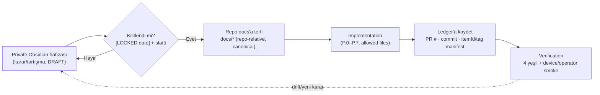

# Obsidian to Git Promotion Rules

<!-- gh-toc -->

## İçindekiler

- [Executive Summary](#executive-summary)
- [Why It Exists](#why-it-exists)
- [Current Canon](#current-canon)
- [Failure Modes](#failure-modes)
- [Examples](#examples)
- [Runtime Implementation](#runtime-implementation)
- [Known Gaps](#known-gaps)
- [Open Questions](#open-questions)
- [Decision History](#decision-history)
- [Related Notes](#related-notes)

> [!canon] Purpose — **Bu vault'un** repo'ya nasıl geri beslediği: private Obsidian hafızası → kilitlenen karar → repo docs → implementation → ledger → verification. Bir fikir hangi noktada "kod yazılabilir canon" olur?

## Executive Summary

Cairn'de bilgi iki yönde akar. [[Documentation Workflow]] **repo → vault** yönünü (cloud kararı → Sync Queue → operatör Obsidian yazar) anlatır. Bu not **ters ve asıl kritik yönü** operasyonelleştirir: **private Obsidian hafızası → kilitlenen karar → repo docs → implementation → ledger → verification.** Kural: **bir Obsidian notu asla doğrudan kod yazdırmaz.** Bir fikir kilitli-canon olana ve repo-relative bir dokümana **terfi (promote)** edene kadar implementation başlamaz. Bu, "en yetkili doküman (v1 Locked Canon / TOP CANON) en keşfedilemeyen olması" hastalığının ilacıdır.

## Why It Exists

Redesign planının teşhisi: en yüksek-yetkili pedagoji dokümanı (`Le_Mot_Locked_Canon_and_Claude_Prompts_v1.md`, "TOP CANON") **operator-vault'ta, uncommitted, cloud ajanının okuyamadığı** yerdedir — "en yetkili doküman en az keşfedilebilir olanı; bu ters." Cloud ajanı repo'da olmayan canon'a göre kod yazamaz. Promotion Rules, canon'un vault'tan repo'ya **kontrollü, statülü, tek-yönlü** akışını tanımlar; böylece implementation her zaman repo-okunabilir canon'a dayanır.

## Current Canon

### İki dokümantasyon evi + köprü
> [!canon] Üç ev: **repo `docs/`** (cloud-canonical, agent-readable) · **Obsidian vault** (operator-only, local session'da okunur) · **operator-vault `Le Mot .md/`** (TOP CANON dâhil, uncommitted). Cloud vault'a **yazamaz**; köprü `docs/CLOUD_SYNC_QUEUE.md`'dir. Bu vault (`CAIRN_OBSIDIAN_PRODUCT_BRAIN`) private product-brain'dir; repo READ-ONLY.

### Promotion akışı (vault → repo → runtime)

### Terfi kuralları
1. **Bir Obsidian notu doğrudan kod yazdırmaz.** Önce repo-relative bir canon dokümanına (`docs/*`) terfi etmeli. Ajan yalnızca repo'da okuyabildiği canon'a göre kodlar.
2. **Statü ilk üç satırda.** Frontmatter `status:` + `> **[LABEL]**` banner. DRAFT/PARKING LOT canon değildir; yalnızca `[LOCKED <date>]` implementation'ı yetkilendirir.
3. **Tek-yönlü, link kopyalama değil.** Repo syllabus/engine katmanı zaten sağlıklı; vault ona **link verir, kopyalamaz** (kopyalama bir sonraki çelişkiyi doğurur). Repo `docs/`'u vault şemasına uydurmak için yeniden düzenleme.
4. **Cloud tarafı Sync Queue, vault write değil.** Cloud bir karar kilitlerse repo'ya yazar + Sync Queue satırı ekler; Obsidian yazımını operatör drain eder ([[Documentation Workflow]]).
5. **Ledger + verification zorunlu.** Terfi eden karar implement edilince [[Implementation Ledger]]'a (PR/commit/manifest) yazılır; "accepted ≠ implemented ≠ verified" üç bağımsız statü olarak korunur ([[06 Canon and Status Legend]]).
6. **Preserve everything, contaminate nothing.** Karar değişince eskisi `superseded` bannerı + `superseded_by` link'i alır, silinmez; disposition satırı yazılır.

### TOP CANON discoverability
> [!warning] v1 Locked Canon (TOP CANON) operator-vault'ta uncommitted. Terfi yolu: **pointer note now + import decision (full commit vs committed summary)** — human decision. Cloud ajanı "en önemli doküman operatörün Desktop'ında bir yerde" ile bırakılmaz; en azından bir pointer + import row olmalı (redesign plan §12).

### CLAUDE-drift
Repo `CLAUDE.md` "Current State" hâlâ legacy 24-lesson/L14 tanımlıyor; `[LEGACY-CODE-REALITY]` banner'ı ayrı, açıkça-onaylı bir repo docs-only adımdır. Bu, terfi edilmemiş legacy'nin aktif sanılmasına karşı en yüksek runtime-alignment riski.

## Failure Modes
- **Vault notundan doğrudan kodlama** → canon-free coding; en pahalı hata. Kural: önce repo'ya terfi.
- **TOP CANON'un uncommitted kalması** → cloud yanlış/eksik canon'la çalışır (aktif discoverability bug).
- **Kopyalama (link yerine)** → repo ve vault divergence → yeni çelişki.
- **Terfi edilmiş kararın ledger'a yazılmaması** → "implemented" ile "verified" karışır; statü modeli çöker.

## Examples
> [!example]
> **Payload Economy v0** (2026-07-04): karar cloud'da kilitlendi → repo'ya (`docs/PAYLOAD_ECONOMY_v0.md`, `0b31c69`) terfi etti + `CLOUD_SYNC_QUEUE`'ye `Status: PENDING` satırı (Obsidian/mempalace sync operatör bekliyor). Repo canonical, vault sync kuyrukta — tam promotion deseni.

> [!example]
> **Migration debt (ters uyarı):** `streak` kolonu `schema.sql`'den düştü ama deployed DB'de kalabilir. Bir vault notu "streak gitti" dese de bu, "streak UI'ya döner" **çıkarımını** yetkilendirmez. Terfi yalnızca yazılı kilitli kararı taşır, çıkarımı değil.

## Runtime Implementation
### Code References
Süreç kanonu. Prior art: `docs/obsidian/obsidian-note-tree-redesign-plan-v0.md` (promotion intent, phased migration), `docs/README.md` (Git-vs-Obsidian public/private sınırı), `docs/CLOUD_SYNC_QUEUE.md`.
### Product-Stage Availability
Tüm stage'lerde bağlayıcı; bir süreç kuralı.

## Known Gaps
- **v1 Locked Canon (TOP)** hâlâ uncommitted — en büyük terfi açığı.
- `CLAUDE.md` "Current State" legacy banner'ı henüz eklenmedi (ayrı onaylı adım).
- Bu product-brain vault'un kendisi repo'ya terfi mekanizması henüz manuel (operatör).

## Open Questions
> [!open-loop] TOP CANON nasıl import edilecek — full commit mi, committed summary + pointer mi? Human decision. → [[05 Open Loops]]

## Decision History
- Redesign plan v0 (promotion intent + phased, review-gated migration; Phase 3 = tek dosya-taşıyan faz, approval-gated). Cloud Mode Addendum (Sync Queue köprüsü). D-34 Cairn spec import + precedence chain.

## Related Notes
[[Documentation Workflow]] · [[Development Workflow]] · [[Implementation Ledger]] · [[08 Source of Truth Map]] · [[Decision Index]] · [[06 Canon and Status Legend]] · [[00 Le Mot Holy Codex]]
