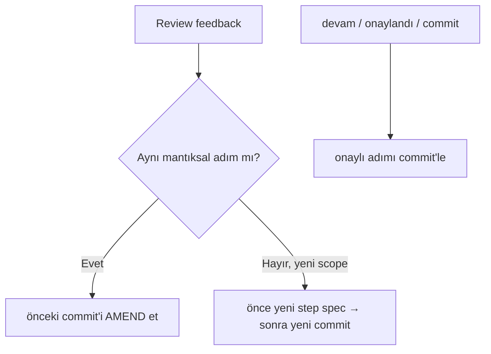

# PR Discipline

<!-- gh-toc -->

## İçindekiler

- [Executive Summary](#executive-summary)
- [Why It Exists](#why-it-exists)
- [Current Canon](#current-canon)
- [How It Works](#how-it-works)
- [Failure Modes](#failure-modes)
- [Examples](#examples)
- [Runtime Implementation](#runtime-implementation)
- [Known Gaps](#known-gaps)
- [Open Questions](#open-questions)
- [Decision History](#decision-history)
- [Related Notes](#related-notes)

> [!canon] Purpose — Cairn'de bir PR'ın neye benzemesi gerektiği: **tek niyet, dar diff, conventional commit, review-then-commit, squash-merge.**

## Executive Summary

Cairn'in en katı kuralı: **One PR = one product intention.** PR'lar küçük ve cerrahi tutulur; her PR tek bir ürün niyetine karşılık gelir; commit mesajları conventional; merge stratejisi **squash** (K5); review concern'ü aynı adıma aitse yeni commit yerine **amend**. İçerik PR'ları için ek katman: **bir batch = bir content-only PR = bir Haktan pedagojik review** ([[Content Production Workflow]]). Görülmemiş UI davranışı `[awaiting device pass]` etiketiyle branch'te bekler, merge edilmez.

## Why It Exists

Reviewer diff'i kafasında tutabilmeli; scope smuggling doğrulamayı ve rollback'i imkânsızlaştırır. Local-first veri kaybı geri alınamaz olduğundan (YASA 1) her schema değişikliği migration'ıyla aynı PR'da gelir. Squash, history'yi okunur tutar.

## Current Canon

> [!canon] **One PR = one product intention.** Bir workstream birden çok step spec içerebilir ama her PR tek niyete eşlenir. *"Fix TTS + redesign Daily Review + clean docs"* tek PR'a girmez.

### Kurallar

| Kural | İçerik | Kaynak |
|---|---|---|
| Tek niyet | Bir PR = bir ürün niyeti; scope smuggling yok | MASTER_PIPELINE §P.1, workstreams README §2–§3 |
| Cerrahi diff | Küçük diff, dar patch, opportunistic refactor yok; refactor gerekirse **ayrı PR** | karpathy §3, Rule 2 |
| Conventional commits | `feat: fix: refactor: docs: test: chore: build:` — belirsiz "update stuff"/"fix things" yasak | MASTER_PIPELINE §P.5 |
| Review-then-commit | Onaysız commit yok; amend vs new-commit ayrımı | §P.5, [[Codex Review Workflow]] |
| Squash-merge | K5 — squash-merge convention kalıcı | STATUS "Operator decisions" K5 |
| YASA 1 | Schema değişikliği ⇒ migration **aynı PR**; yazılamıyorsa değişiklik yasak | ROADMAP YASA 1, karpathy §5 |
| YASA 2/3 | Shipped itemId/error-tag immutable; yeni id'ler **aynı PR**'da manifest'e | STATUS #177/#186 |
| Screenless golden rule | Görülmemiş UI merge edilmez; `[awaiting device pass]` branch'te bekler | karpathy §5, STATUS #180 |
| Validator-first | Validasyon kırmızı olan taslak review'a **ulaşmaz** | CONTENT_FACTORY_CONTRACT §1.2 |

### Commit vs amend

### Cloud PR mekaniği
Cloud'da PR **yalnızca `mcp__github__create_pull_request`** (ve ilgili `mcp__github__*`) ile açılır; `gh`/`hub` CLI yoktur. Merge/push-to-main/branch-delete = **Operator-only** ([[Agent Collaboration]]).

## How It Works
### Inputs
Onaylı step spec + geçen validasyonlar + review raporu.
### Outputs
Tek-niyetli, conventional-mesajlı, squash'a hazır bir PR; içerik PR'ında ek olarak per-lesson review sheet + validation results.
### Guardrails
- Away-agent gerçek PR açamaz (propose-only) — bu bir `ACTION_REQUIRED`'dır ([[Task Context Packs]]).
- Docs-only PR ile production kodu karıştırılmaz (Sprint 12 shape kuralı).

## Failure Modes
- **Scope smuggling** → PR reddi / reconcile.
- **Migration'sız schema PR** → YASA 1 ihlali; veri kaybı riski; yasak.
- **Wrong-order batch landing** → device-day K2 sırası (#174 → #180 → seen-layer) bozulursa zincir durdurulur; *partial landing kabul, wrong-order landing değil*.

## Examples
> [!example]
> **Squash + tek niyet:** #179 "deriveDrill + practice selector v0" — factory'nin ilk ürünü, tek dilim, squash-merge.
> **Amend:** review "Unlocked!" copy'sine concern verdi → aynı passive-mirror-copy adımına ait, yeni commit yerine amend.

## Runtime Implementation
### Code References
Süreç kanonu. Uygulama izleri: `docs/workstreams/`, `docs/STATUS.md` (K5, YASA'lar), `scripts/` (manifest:add / validators).
### Product-Stage Availability
Tüm stage'lerde bağlayıcı.

## Known Gaps
- Stale merged `claude/*` branch temizliği operator-only (cloud git proxy delete-push 403) — açık operator blocker.

## Open Questions
> [!open-loop] Content-only PR ile runtime-unlock PR'ı ayrımı: L7–L15 kayıtlı ama Home L6-cap'te; görünürlük ayrı bir smoke-bearing unlock PR gerektirir. → [[05 Open Loops]]

## Decision History
- K5 squash-merge locked. YASA 1 (#178) / YASA 2 (#177) / YASA 3 (#186). Golden rule of screenless work (karpathy §5).

## Related Notes
[[Development Workflow]] · [[Codex Review Workflow]] · [[Validation Gates]] · [[Content Production Workflow]] · [[Agent Collaboration]] · [[00 Le Mot Holy Codex]]
