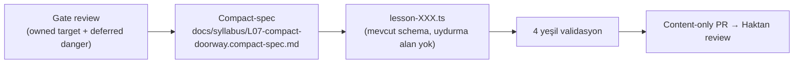

# Syllabus Production Workflow

<!-- gh-toc -->

## İçindekiler

- [Executive Summary](#executive-summary)
- [Why It Exists](#why-it-exists)
- [Current Canon](#current-canon)
- [How It Works](#how-it-works)
- [Failure Modes](#failure-modes)
- [Examples](#examples)
- [Runtime Implementation](#runtime-implementation)
- [Known Gaps](#known-gaps)
- [Open Questions](#open-questions)
- [Decision History](#decision-history)
- [Related Notes](#related-notes)

> [!canon] Purpose — Bir dersin **spec olarak** nasıl üretildiği: gate-review → compact-spec → lesson dosyası; retrofit dalgaları; band-map disiplini. (Dosya-düzeyi üretim: [[Content Production Workflow]].)

## Executive Summary

Syllabus üretimi repo `docs/syllabus/` altında yürür — bu, üründeki **en sağlıklı doküman seti**. Disiplin: her ders önce bir **gate review**'dan geçer (bu ders neyi sahiplenir, hangi tehlikeye genişlemez), sonra bir **compact-spec**'e damıtılır, sonra bir `lesson-XXX.ts` dosyasına dönüşür. Spine **L1 (Survival Kit)**'ten başlar; L0 sayılmaz ([[L0 The First Step]]). Retrofit **dalgalar** halinde: Wave 1 sadece L1–L3 yeni modele taşındı, L4–L15 çalışıyor (bozma), L16+ doğrudan yeni modelde doğar.

## Why It Exists

İki syllabus çelişkisi (v1 spine vs legacy 24-lesson) ürünün en büyük doküman hastalığıydı. Repo syllabus katmanı, per-lesson gate-review → compact-spec disipliniyle bunu çözer: her ders açıkça ne öğrettiğini ve **hangi tehlikeye genişlemeyeceğini** yazar (örn. L7 aller = hareket, futur proche recognition-only; L12 est-ce que = wrapper only; L15 `il faut + inf.` only, subjunctive değil).

## Current Canon

> [!canon] **Aktif spine (v1):** Core 150, L1 "Je suis"'den başlar, soft paywall **Campfire ~L24** (L1–L20 free). Legacy 24-lesson / L14-paywall / 11-section flow = **SUPERSEDED** ([[06 Canon and Status Legend]]).

### Üretim zinciri

Compact spec, tam spec'in olduğu yerde **kazanır** (§1.3). Doorway/compact ders için tam iki yeni item (L7 örneği).

### Retrofit dalga stratejisi (D-31)
| Dalga | Ne taşınır | Ne kalır |
|---|---|---|
| Wave 1 (Taş 1) | Sadece **L1–L3** yeni modele (tester'ın ilk teması) | L4–L15 eski (çalışıyor, bozma) |
| Wave 2 (Taş 4 / PR 21) | L4–L15 migrate | — |
| Yeni | L16+ doğrudan yeni modelde doğar | — |

### Lesson-flow numeric budget (D-29)
Toplam ekran bütçesi **11–14** (öğrencinin gördüğü her ekran sayılır): 9–11 action + 2–3 insight-card. Micro-actions 15–25; per-screen 1–3 (cap 4); 7–10 dk; **1–4 yeni aktif chip (curriculum disiplini, immutable)**. Insight kartları anlama göre yerleştirilir (opener/rescuer/sealer), asla her boşluğa filler değil.

### L1 chip listesi
> [!warning] L1 chip listesi **kasıtla finalize DEĞİL** — aktif açık tasarım kararı (~34–35 hedef obje, 31 mevcut aday, 3–4 daha eklenecek). Nihai listeyi **uydurma**.

## How It Works
### Inputs
Gate-review notları, chip taxonomy, band-map (L10–L20 v0 working plan, locked değil), Cairn spec §65/§66, mevcut shipped v1 lessons.
### Outputs
Compact-spec + `lesson-XXX.ts` + `itemRegistry`/`V1_LESSONS` kayıtları + per-lesson review sheet.
### Guardrails
- Active / Supported / Recognition-only / Recycled ayrımı korunur.
- Cancelled **SYLL.1** framing'i canlandırma.
- L17–L23 rewrite v1 syllabus'e uyar, eski taxonomy temizlik varsayımlarına değil.
- A Small Moment L16'da hafifçe seed, ~L19'da tekrar; retention/kullanışlılık, **grammar engine DEĞİL**, chatbot DEĞİL.

## Failure Modes
- **Bir ders sahiplenmediği tehlikeye genişlerse** (örn. L3 inversion, L5 partitive) → gate-review sınırı ihlali.
- **Legacy syllabus'ü aktif sanmak** → yanlış ders üretimi.
- **Nihai L1 chip listesini uydurmak** → açık tasarım kararını erken kapatmak.

## Examples
> [!example]
> **L6 Un petit moment** — integration payoff (zero-new-item recombination örneği: L16 fixture #35/#37/#38 chain smoke PASS). **L7** compact doorway spec, frozen-chunk + tam iki yeni item.

## Runtime Implementation
### Code References
`docs/syllabus/*` (template v1.1, archetypes, canonical-ID v0.1, ai-generation-contract, L10–L20 band map, L01–L15 spec + gate reviews); `lemot-app/content/lessons/v1/` (lesson-000..015).
### Product-Stage Availability
L0–L6 learner-visible (dev-apk); L7–L15 kayıtlı ama Home L6-cap'te; L16–L17 spec-only (dosya yok).

## Known Gaps
- L16 = NEXT (gate review önce). L18–L24 roadmap. Band-map L10–L20 v0, locked değil.
- Progress hâlâ legacy 24-lesson/264-section taxonomy'sini gösteriyor (learning-engine adoption'a bağlı).

## Open Questions
> [!open-loop] Completion'ın canonical birimi; Daily Review ne zaman available olur; Progress legacy taxonomy'yi ne zaman bırakır. → [[05 Open Loops]]

## Decision History
- D-06 L0 bridge / spine L1'den başlar. D-07 Round 1 spine L1–L6. D-31 retrofit dalgaları. D-29 ekran bütçesi. D-32 type-set freeze (~10 tip).

## Related Notes
[[Content Production Workflow]] · [[Syllabus Overview]] · [[Syllabus Design Rules]] · [[Validation Gates]] · [[PR Discipline]] · [[00 Le Mot Holy Codex]]
