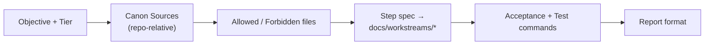

# Task Context Packs

<!-- gh-toc -->

## İçindekiler

- [Executive Summary](#executive-summary)
- [Why It Exists](#why-it-exists)
- [Current Canon](#current-canon)
- [How It Works](#how-it-works)
- [Failure Modes](#failure-modes)
- [Examples](#examples)
- [Runtime Implementation](#runtime-implementation)
- [Known Gaps](#known-gaps)
- [Open Questions](#open-questions)
- [Decision History](#decision-history)
- [Related Notes](#related-notes)

> [!canon] Purpose — Bir ajana verilen görevin **kendi kendine yeten** bağlam paketi: prompt pack / step spec (P.2) + away-run şablonu + görev kuyruğu. Ajan, ürünü baştan türetmeden güvenle iş yapabilmeli.

## Executive Summary

Her görev, bir **context pack** ile paketlenir: net objective, tier, canon kaynakları (hepsi repo-relative), allowed/forbidden dosyalar, acceptance criteria, test komutları ve rapor formatı. Bu, MASTER_PIPELINE'ın **P.2 Prompt Pack / Step Spec** kabuğudur ve away işlerde `AWAY_AGENT_RUN_TEMPLATE` + `AWAY_TASK_QUEUE` ile eşlenir. Amaç: ajan notu okuyunca *ne yapacağını, nereye dokunacağını, neyin done sayılacağını* re-derive etmeden bilmeli; **draft'ı canon sanmamalı**.

## Why It Exists

Belirsiz görev = scope kayması + canon uydurma. Bir bağlam paketi, "allowed files" ve "forbidden" ile diff'i sınırlar; "acceptance criteria" ile done'ı tanımlar; "canon sources" ile ajanın hangi dokümana güveneceğini söyler. LM-3+ işlerde bu paket bir **workstream step spec**'e (`docs/workstreams/Sprint{N}_SW{X}_{slug}.md`) yazılır; kod, spec'ten sonra gelir.

## Current Canon

### Prompt pack kabuğu (P.2)

> [!canon] Her Claude görevi şu iskeleti kullanır:
> **Objective** (tek net hedef) · **Tier** (LM-1..5) · **Canon Sources** (spesifik repo-relative dosyalar; *active canon wins over archive*) · **Current State** · **Step Spec** (kodlamadan önce workstream'e ekle/güncelle) · **Allowed Files** (tam dosya/dizin) · **Forbidden** (alakasız dosyaya dokunma; XP/streak revival yok; paywall gate'i değiştirme; onaysız commit yok) · **Implementation Rules** (küçük cerrahi diff, TS strict, mutasyon yok, dar route cast) · **Acceptance Criteria** · **Test Commands** · **Report Format**.

### Away-run şablonu ve kuyruğu
- **`AWAY_AGENT_RUN_TEMPLATE`** → tek rapor dosyası şablonu: Task / Repo state / Completed / Files changed / Verification / Draft PRs / Blockers / ACTION_REQUIRED / Not done by rule / Recommended next step ([[Agent Collaboration]] §6).
- **`AWAY_TASK_QUEUE`** → seeded görevler, hepsi LM-1/LM-2, single-intention, read-only veya propose-only:

| Task | Ne | Mod | Statü |
|---|---|---|---|
| TASK-001 | post-APK docs backfill | propose-only | READY |
| TASK-002 | fiziksel APK smoke checklist finalize | propose-only | READY |
| TASK-003 | branch cleanup audit | report-only | READY |
| TASK-004 | Sprint 12 closure readiness report | report-only | READY |

> Queue kuralı: görevleri LM-1/LM-2, tek-niyetli, read-only veya propose-only tut.

### Cloud-safe path kuralı
Bir context pack içindeki tüm referanslar repo-relative (`docs/...`, `lemot-app/...`) olmalı. `~/Desktop/...` veya Obsidian-vault yolları cloud'da okunamaz; operator-vault canon'una atıf gerekiyorsa satır **"operator-vault (Sync Queue if changed)"** olarak işaretlenir (workstreams README §5).

## How It Works

### Inputs
ChatGPT'nin scope'ladığı görev + aktif canon + git durumu.
### Outputs
Kendi kendine yeten bir prompt pack / step spec; away işte bir `.agent-runs/` raporu.
### Guardrails
LM-3+ task kodlanmadan önce bir workstream spec **olmalı**; yoksa önce oluştur (workstreams README §1). LM-1/LM-2 bu adımı atlayabilir.

## Failure Modes
- **Allowed files eksik/geniş** → scope kayması.
- **Draft'ın canon sanılması** → yanlış karar; `status`/banner ile önlenir.
- **Operator-vault path'inin cloud'da okunabilir sanılması** → boş bağlam; "Sync Queue if changed" işareti şart.

## Examples
> [!example]
> Örnek step spec adı: `docs/workstreams/Sprint12_SW5_l17-l23-v1-syllabus-rewrite.md`. İçinde Goal / Tier / Canon Sources / Out of scope / Steps (her step: Goal, Files expected, Acceptance, Tests, Review status).

## Runtime Implementation
### Code References
Süreç kanonu. Şablonlar: `docs/MASTER_PIPELINE_v1.2.1.md` §P.2/§11, `docs/agents/AWAY_AGENT_RUN_TEMPLATE.md`, `docs/agents/AWAY_TASK_QUEUE.md`, `docs/workstreams/README.md`.
### Product-Stage Availability
Tüm stage'lerde bağlayıcı.

## Known Gaps
- Seeded queue henüz drain edilmemiş (TASK-001..004 READY).

## Open Questions
> [!open-loop] Round 1 sonrası docs backfill (TASK-001) ve fiziksel smoke checklist (TASK-002) operator device-day'e bağlı. → [[05 Open Loops]]

## Decision History
- Prompt pack kabuğu MASTER_PIPELINE §P.2/§11. Away template + queue Agent Constitution ile aynı wave.

## Related Notes
[[Agent Collaboration]] · [[Claude Code Workflow]] · [[Development Workflow]] · [[Validation Gates]] · [[Documentation Workflow]] · [[00 Le Mot Holy Codex]]
