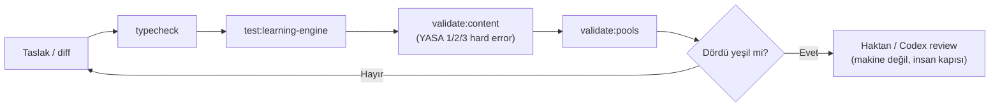

# Validation Gates

<!-- gh-toc -->

## İçindekiler

- [Executive Summary](#executive-summary)
- [Why It Exists](#why-it-exists)
- [Current Canon](#current-canon)
- [How It Works](#how-it-works)
- [Failure Modes](#failure-modes)
- [Examples](#examples)
- [Runtime Implementation](#runtime-implementation)
- [Known Gaps](#known-gaps)
- [Open Questions](#open-questions)
- [Decision History](#decision-history)
- [Related Notes](#related-notes)

> [!canon] Purpose — Bir değişikliğin review'a/merge'e geçmeden önce yeşil olması gereken makine kapıları ve bunların her birinin **neyi koruduğu**.

## Executive Summary

Cairn'in kod ve içerik kalitesi beş validasyon komutuyla korunur: `npm run typecheck`, `npm run test:learning-engine`, `npm run validate:content`, `npm run validate:pools`, `npx expo-doctor`. **Content Factory** için dört-yeşil kapısı (`typecheck` + `validate:content` + `validate:pools` + `test:learning-engine`) review'dan **önce** zorunludur — validasyonu kırmızı olan taslak review'a ulaşmaz (**validator-first**). Sistem yasaları (**YASA 1/2/3**) `validate:content` içinde **hard error** olarak mekanize edilmiştir: shipped itemId/error-tag değişimi veya kayıtsız yeni id build'i kırar.

## Why It Exists

Local-first veri kaybı geri alınamaz (YASA 1) ve içerik ~80+ lessona ölçeklenecek. Makine kapıları, insan review'ını *önce* güvenli hale getirir: Haktan pedagojik review'a yalnızca teknik olarak temiz taslaklar gider. Motor saflığı (karpathy) yalnızca testlerle garanti edilir.

## Current Canon

### Kapılar ve neyi gate ettikleri

| Komut | Ne çalıştırır | Neyi gate eder | Fail davranışı |
|---|---|---|---|
| `npm run typecheck` | TypeScript strict tip kontrolü | Tip güvenliği; her PR'ın ön koşulu | Tip hatası = kırmızı, PR yok |
| `npm run test:learning-engine` | Motor kontrat testleri (pure/deterministic/explicit `now`/fail-closed) | Engine-purity kontratı; snapshot replay invariant | Motor determinizmi/saflığı kırılırsa fail |
| `npm run validate:content` | İçerik + registry validator; **YASA 1/2/3 hard error'ları** | itemId immutability (YASA 2), error-tag immutability (YASA 3), schema→migration (YASA 1), kayıtsız/duplicate itemId, sentence-chip lint | **HARD ERROR** — 0 hard error/warning/info hedefi |
| `npm run validate:pools` | Practice pool bütünlüğü | Pool referans tutarlılığı | 6 bilinen legacy warning OK; yeni hata fail |
| `npx expo-doctor` | Bağımlılık/build sağlığı | Dependency/build değişiminde | Uyumsuzluk raporlar |

> [!canon] **Content Factory dört-yeşil kapısı (§1.6):** review'dan önce dördü de yeşil — `typecheck`, `validate:content`, `validate:pools`, `test:learning-engine`. Karpathy üçlü kapısı (motor PR'ları): `typecheck`, `validate:content`, `test:learning-engine`.

### YASA hard errors (mekanize)

> [!warning]
> - **YASA 1** — schema değişikliği ⇒ migration **aynı PR**; yazılamıyorsa değişiklik yasak. Rails #178 (pure registry/runner, unknown version → fail-safe "unsupported", sıfır gerçek migration).
> - **YASA 2** — shipped itemId immutable; rename/delete = öksüz öğrenci kanıtı → `validate:content` **HARD ERROR** (#177, 54-id manifest, `npm run manifest:add`). K3: kayıtsız registry id = HARD ERROR (#183).
> - **YASA 3** — shipped error-tag immutable; iki-yönlü validator ("kullanımdan düşen shipped tag → ERROR" ve "kayıtsız yeni tag → ERROR"), 54 tag frozen (#186, `npm run manifest:add-tag`).

### Round 1 pre-build checkleri
`DEV_APK_SMOKE_TEST_CHECKLIST.md §2`: temiz/sync main → `typecheck` → `test:learning-engine` → `validate:pools` (6 bilinen legacy warning OK) → `validate:content` (0 hard/warning/info) → `eas.json` profile `preview` → `EXPO_PUBLIC_PRODUCT_STAGE=dev-apk` → Supabase env YOK → AI dev-apk'te off. Fiziksel smoke = **operator-only**; cloud tek başına bu dosyadan PASS iddia edemez.

## How It Works

Makine-checked (review'da tekrar tartışılmaz): typecheck, validator/sentence-chip lint, pool integrity, duplicate/unknown itemId, CI. İnsan-checked (makine DEĞİL): pedagojik promise, chip sayısı/tonu, "Does it still feel like Cairn?" ([[Content Production Workflow]] §3).

### Product-Stage Availability
Validasyonlar tüm stage'lerde çalışır; Round 1 dev-apk için AI-off + Supabase-env-yok ile.

## Failure Modes
- **Validator-first atlanırsa** → kırmızı taslak review'a girer, Haktan zamanı israf olur; kural: kırmızı taslak review'a ulaşmaz.
- **Schema-file ≠ deployed DB** → validate yeşil olsa da deployed DB migration'ı operator-only; raporda belirtilmeli.
- **`validate:pools` 6 legacy warning'i** beklenen; yeni warning'ler yakalanmalı.

## Examples
> [!example]
> Bir batch yeni lesson: agent önce `lesson-XXX.ts` + `itemRegistry` eklemesi + `V1_LESSONS` kaydı yazar, sonra dördü çalıştırır. Kayıtsız bir yeni itemId → `validate:content` HARD ERROR (K3) → taslak review'a gitmeden düzeltilir.

## Runtime Implementation
### Code References
`lemot-app/package.json` (script tanımları), `lemot-app/content/itemRegistry.ts` (`ITEM_REGISTRY`, 54 item frozen), `lemot-app/scripts/` (validators, `manifest:add`, `manifest:add-tag`, `telemetry:report`).
### Test References
`lemot-app/content/learning-engine/*` (kontrat testleri; suite main'de 582→613 passed, screenless sprint sonrası).
### Product-Stage Availability
sandbox / dev-apk / public-beta — hepsinde bağlayıcı.

## Known Gaps
- **v1 pedagogy lint** (piecesUsed ≠ sentence enforcement) henüz implement değil (KNOWN_GAPS #5).
- Edge functions (519 LOC) test'siz (C3/C13); `aiEnabled` flip'inden önce edge regression guard'ları gerekir.
- 54-vs-56 item drift gerçek (`shipped-item-ids.json` 56, registry 54); K3 iki-yönlü kontrol bunu yakalamak için var.

## Open Questions
> [!open-loop] Deferred validators V1/V2/V6/V7/V8/V9 kasıtla mekanize edilmedi (schema alanları / final layout gerektiriyor). → [[05 Open Loops]]

## Decision History
- YASA 1 (#178) / YASA 2 (#177) / YASA 3 (#186) / K3 unrecorded-itemId hard error (#183). Karpathy üçlü kapı (K4). Content Factory dört-yeşil kapısı (§1.6).

## Related Notes
[[Content Production Workflow]] · [[PR Discipline]] · [[Claude Code Workflow]] · [[Development Workflow]] · [[Codex Review Workflow]] · [[00 Le Mot Holy Codex]]
