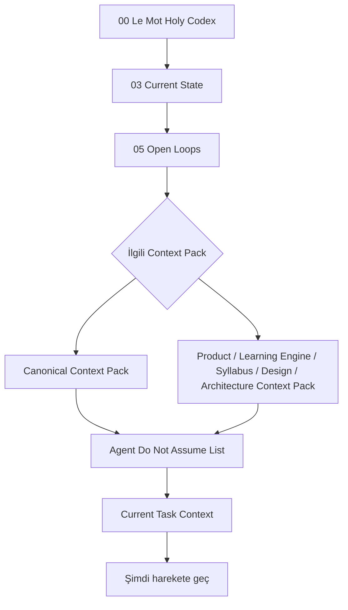

# Agent Start Here

> [!canon] Bu not, **bir ajanın (Claude/Codex/Explore) BU VAULT'u nasıl tüketeceğini** anlatır.
> Kod tabanını değil, **kurumsal hafızayı** okuma sırasıdır. Amaç: kanon uydurmadan,
> doğru bağlamı yükleyip harekete geçmek.

## Neden bir okuma sırası var?

Le Mot / Cairn'in üç paralel runtime'ı, iki canlı roadmap'i ve büyük bir "superseded ama
silinmemiş" tarihi var. Rastgele bir nota dalarsan, çok muhtemelen **bayat bir kanonu**
güncel sanırsın. Bu vault bunu önlemek için var; ama ancak sırayla okunursa işe yarar.

## Zorunlu okuma sırası (her görev öncesi)

1. **[[00 Le Mot Holy Codex]]** — ürün nedir, üç runtime, vault haritası. 30 saniyelik zemin.
2. **[[03 Current State]]** — bugün gerçekte ne çalışıyor, HEAD hash'i, ne bloke. **Hızlı bayatlar**; şüphedeysen `docs/STATUS.md`'yi oku.
3. **[[05 Open Loops]]** — çözülmemiş işler, operator blocker'ları. Kapalı sandığın bir şey burada açık olabilir.
4. **İlgili Context Pack** — göreve göre biri (veya birkaçı):
   - Genel/çapraz iş → **[[Canonical Context Pack]]** (her zaman güvenli başlangıç).
   - Ürün/scope/monetization → **[[Product Context Pack]]**.
   - Motor/mastery/error/events → **[[Learning Engine Context Pack]]**.
   - Ders/chip/L-numarası → **[[Syllabus Context Pack]]**.
   - UI/görsel/copy → **[[Design Context Pack]]**.
   - Runtime/storage/route/Supabase → **[[Architecture Context Pack]]**.
5. **[[Agent Do Not Assume List]]** — taç not. Yaygın bayat tuzaklar. **Koda dokunmadan önce oku.**
6. **[[Current Task Context]]** — şu anki odak (L1 chip redesign + bu Obsidian beyni + Round 1 closeout).

Sonra: iş **kod ise** → [[Prompt Writing Standards]] ile scope'u daralt, ardından repo'daki
`docs/engineering/karpathy.md` mühendislik sözleşmesine uy.

## Üç değişmez kural

1. **Kanon uydurma.** Vault'ta bir cevap yoksa, cevabı **icat etme** — `docs/`'a git veya
   [[Unknowns]] / [[Needs Verification]] işaretle. Load-bearing gerçekleri
   [[Canonical Context Pack]] tutar; oradaki bir sayı ile çelişen bir şey görürsen dur ve doğrula.
2. **Statüye bak.** "Kabul edildi", "kodlandı", "cihazda doğrulandı" **üç ayrı şey**.
   [[06 Canon and Status Legend]]. Bir motor modülünün var olması, sevkedilen yüzeye
   **bağlı** olduğu anlamına gelmez (runtime C = sandbox-only).
3. **Vault operator-only yazılır.** Bulut/away ajanı bu vault'a **yazmaz**; kalıcı kararları
   `docs/CLOUD_SYNC_QUEUE.md`'ye kuyruklar. Repo'yu bu görevde değiştirme.

## Bu vault ne DEĞİLDİR

- Canlı bir görev takipçisi değil (o `docs/STATUS.md` + Open Loops).
- Kod tabanının kopyası değil — kod tek ana evinde (`lemot-app/…`) yaşar, buradaki notlar **link verir**, kopyalamaz.
- Onay makamı değil — hiçbir vault notu bir commit'i, PR'ı veya scope genişletmesini yetkilendirmez. Onay **yalnızca** Operator'dan (`devam` / `onaylandı` / `commit`) gelir.

## İlgili Notlar
- [[00 Le Mot Holy Codex]] · [[03 Current State]] · [[05 Open Loops]]
- [[Canonical Context Pack]] · [[Agent Do Not Assume List]] · [[Prompt Writing Standards]]
- [[Task Context Packs]] (operasyon karşılığı) · [[Agent Collaboration]]

<!-- gh-nav -->

## 🧭 GitHub Navigation

[⬆ README](../../README.md) · [🪨 Holy Codex](../00_START_HERE/00%20Le%20Mot%20Holy%20Codex.md) · [Current State](../00_START_HERE/03%20Current%20State.md) · [Open Loops](../00_START_HERE/05%20Open%20Loops.md)

**Bu klasördeki notlar (11_AGENT_CONTEXT):**

- [⛔ Agent Do Not Assume List](./Agent%20Do%20Not%20Assume%20List.md)
- [Agent Start Here](./Agent%20Start%20Here.md) ⟵ *bu not*
- [Architecture Context Pack](./Architecture%20Context%20Pack.md)
- [Canonical Context Pack](./Canonical%20Context%20Pack.md)
- [Current Task Context](./Current%20Task%20Context.md)
- [Design Context Pack](./Design%20Context%20Pack.md)
- [Learning Engine Context Pack](./Learning%20Engine%20Context%20Pack.md)
- [Product Context Pack](./Product%20Context%20Pack.md)
- [Prompt Writing Standards](./Prompt%20Writing%20Standards.md)
- [Syllabus Context Pack](./Syllabus%20Context%20Pack.md)
