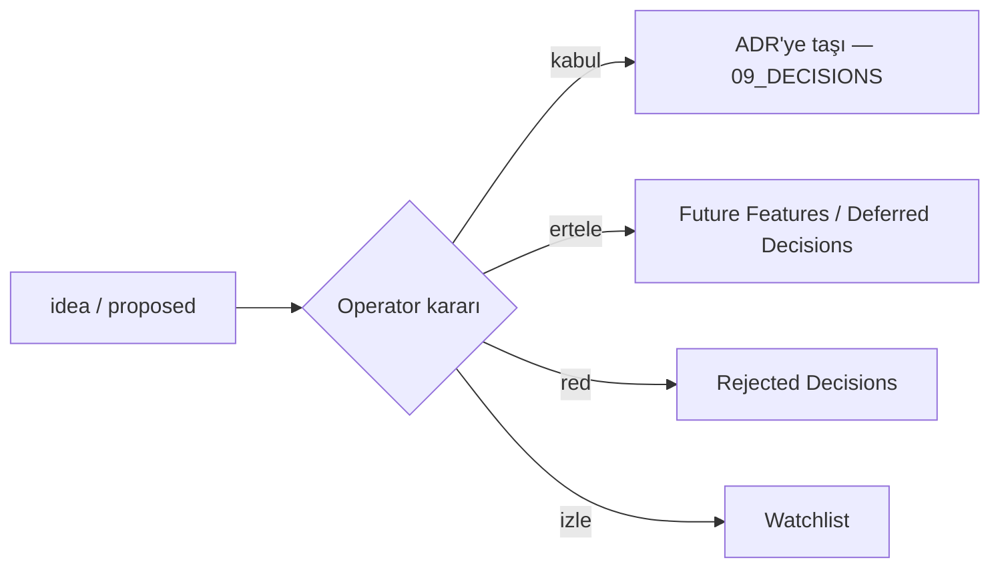

# Idea Inbox

> [!warning] Bu klasördeki **her şey FİKİRDİR — kanon değil.** Bir fikir, açıkça kabul edilip bir ADR'ye
> (`09_DECISIONS`) taşınana kadar `proposed`/`idea` kalır. Buradan hiçbir agent doğrudan implementation
> yetkisi çıkaramaz.

## Bir fikir buraya nasıl girer?

1. **Yakala.** Ham fikri kaybetmeden not al — mükemmel olması gerekmez.
2. **Şablonu kullan.** [[Research Note Template]] (kopyala): The Idea / Where It Would Live / Why It Might Matter / Open Questions / Decision Needed From / Related.
3. **Ev sor (Rule 5).** Her fikrin bir evi olmalı: **Lesson? Daily Review? Practice Pool? Mon Lexique? Post-beta? Archive?** Evsiz fikir olgunlaşmamıştır.
4. **Doğru nota koy:**
   - Ders mekaniği fikri → [[Lesson Mechanics Ideas]].
   - Planlanmış/ertelenmiş büyük özellik → [[Future Features]].
   - Açık pedagoji/mimari sorusu → [[Research Questions]].
   - Test edilecek hipotez → [[Experiments]].
   - Audit'ten çıkan izlenecek risk → [[Watchlist]].
5. **İndexle.** [[Idea Index]] tablosuna bir satır ekle (statüsüyle).

## Statü yaşam döngüsü

## Sınırlar
- Fikir ≠ karar ≠ implementation. Üçünü ayrı tut ([[06 Canon and Status Legend]]).
- Bir fikri "kabul" yalnızca **Operator** yapar (`devam` / `onaylandı`).
- Bu vault operator-only yazılır; bulut ajanı fikri buraya değil, `docs/CLOUD_SYNC_QUEUE.md`'ye kuyruklar.
- Yasaklı dil fikirleri (XP/streak/reward) baştan **red** — tartışmaya girmeden [[Non-Goals]].

## İlgili Notlar
- [[Idea Index]] · [[Lesson Mechanics Ideas]] · [[Future Features]] · [[Research Questions]] · [[Experiments]] · [[Watchlist]]
- [[Unmapped Ideas]] · [[05 Open Loops]]
