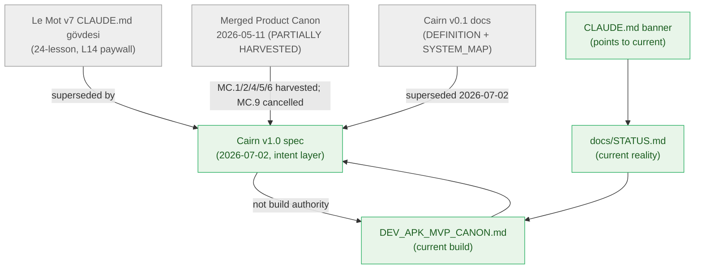

# Historical Canon Map

> [!canon] Bu not, hangi kanon dokümanının hangisini **gömdüğünü** (supersession
> zinciri) tarihsel olarak gösterir. Güncel precedence için [[08 Source of Truth Map]]
> tek doğru kaynaktır; bu not eski katmanların *nasıl* buraya geldiğini anlatır.

## Supersession zinciri

Diyagram: eski katmanlar (gri) yeni aktif katmanlara (yeşil) akar. Güncel
precedence sırası: `CLAUDE.md → docs/STATUS.md → docs/DEV_APK_MVP_CANON.md →
Cairn v1.0 spec`. v1.0 spec "intent layer"dır — build otoritesi değil; "şu an
inşa edilen" için Dev APK canon + STATUS kazanır.

## Katman katman tarih

### CLAUDE.md — iki katmanlı doküman
> [!warning] `CLAUDE.md`'nin **banner'ı (satır 1–11) günceldir**; **gövdesi (12+)
> tarihseldir** (v7 24-lesson roadmap). Banner der ki: "Do not use the legacy
> 24-lesson, L14 paywall, or Sprint 10 language below as active direction unless
> it is explicitly reactivated." Aynı dosyada güncel + tarihsel bir arada olması
> D1 staleness tuzağının kaynağıydı ("Sprint 10 IN PROGRESS" ifadesi).

### Merged Product Canon 2026-05-11 — PARTIALLY HARVESTED
> [!historical] superseded_by: [[Superseded Specs]], [[Product Vision]].
- **Kabul edilenler:** MC.1 / MC.2 / MC.4 / MC.5 / MC.6 (v1 Canon TOP'a alındı).
- **Değişenler:** MC.3 revised · MC.7 re-homed · MC.8 re-mapped.
- **İptal:** MC.9 cancelled.
- Kural: aktif kararlar için Merged 2026-05-11 **okunmaz**; onun yerine güncel
  User Journey / v1 Canon TOP okunur. (Bu materyal operator vault'ta; repoda
  kısmen yansıyor — bkz. [[Missing Source Inputs]].)

### Cairn v0.1 → v1.0
> [!historical] `CAIRN_PRODUCT_DEFINITION_v0.1` ve `CAIRN_PRODUCT_SYSTEM_MAP_v0.1`,
> 2026-07-02'de `CAIRN_FULL_APP_ONE_SHOT_BUILD_SPEC_v1_0.md` tarafından
> **SUPERSEDED**. İkisi de top-line SUPERSEDED banner taşır. Detay: [[Superseded Specs]].
- v1.0 kendi içinde de tarih taşır: **§48–64 win over §31–47**; §47 superseded by
  §64 (reading-guide banner ile korunuyor, fiziksel silinmedi).

### İki roadmap (reconcile edilmemiş)
> [!warning] Aynı anda **iki canlı roadmap** var: `CAIRN_ROADMAP_202607.md`
> (engine-first, Faz 0–7) ve `ROADMAP.md` ("Beş Taş / Five Stones", deployment-
> first, 2026-07-05). Hangisinin diğerini superseded ettiği açıkça yazılmamış;
> README `ROADMAP.md`'yi aktif sprint spec listeler. → [[05 Open Loops]].

## Tarihsel yasak dili (bugün de geçerli)

> [!canon] Bir tarihsel karar **hâlâ bağlayıcı**: XP / streak / level up /
> achievement / "amazing" / "perfect score" / "goal complete" / "come back
> tomorrow" baskısı **yasak** (2026-04-23, UX.1). Bu yasak v7'den doğdu ama
> bugün de aktif — bkz. [[Copy and Tone]], [[Learner Experience Principles]].
> Yani "streak kaldırıldı" tarihsel bir olay; "streak yasak" güncel bir kural.

## Model-routing tablosu — SPEC-VS-REALITY drift
> [!historical] `CLAUDE.md` legacy tablosu Gemini Flash-Lite / Gemini Flash /
> **Claude Haiku** rotalar; gerçek `_shared/providers.ts` zinciri Gemini 2.5
> Flash → Gemini 2.5 Pro → Groq Llama 3.3 → Mistral Small, **Claude yok**. Bu
> D2 doc-sync tuzağı; AI dormant olduğu için pratikte moot. Güncel:
> [[AI Architecture]], [[AI Role and Guardrails]].

## Related Notes
- Yukarı: [[00 Le Mot Holy Codex]] · [[History Index]]
- Güncel precedence: [[08 Source of Truth Map]] · [[Source Ledger]]
- Kardeş: [[Superseded Specs]] · [[Superseded Decisions]] · [[Product Timeline]]
