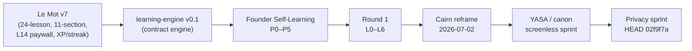

# Product Timeline

<!-- gh-toc -->

## İçindekiler

- [Tek bakışta zincir](#tek-bakışta-zincir)
- [1. Le Mot v7 — HISTORICAL / legacy](#1-le-mot-v7-historical-legacy)
- [2. learning-engine v0.1 baseline (≈2026-06-01) — foundation başlangıcı](#2-learning-engine-v01-baseline-2026-06-01-foundation-başlangıcı)
- [3. Founder Self-Learning Build P0–P5 (Sprint 13, 2026-06-02 → 06-05)](#3-founder-self-learning-build-p0p5-sprint-13-2026-06-02-06-05)
- [4. Round 1 L0–L6 — ACCEPTED & FROZEN](#4-round-1-l0l6-accepted-frozen)
- [4b. Round 1.1 / 1.2 polish — tester-ready + durak noktası](#4b-round-11-12-polish-tester-ready-durak-noktası)
- [5. Cairn reframe — 2026-07-02](#5-cairn-reframe-2026-07-02)
- [6. YASA / canon screenless sprint — 2026-07-05](#6-yasa-canon-screenless-sprint-2026-07-05)
- [7. Privacy sprint → HEAD 02f9f7a](#7-privacy-sprint-head-02f9f7a)
- [Bugün nerede duruyoruz?](#bugün-nerede-duruyoruz)
- [Related Notes](#related-notes)

> [!canon] Bu not ürünün **büyük dönüm noktalarını** kronolojik olarak anlatır.
> Erken evrelerin çoğu **tarihsel/superseded**; sadece en sağdaki uçlar (Cairn
> reframe sonrası, Round 1 L0–L6, YASA/privacy) günceldir. Her aşamada güncel
> karşılığa link verilir.

## Tek bakışta zincir

Diyagram: ürün, gamification'lı bir Duolingo-benzeri v7'den başlayıp; saf,
deterministik bir öğrenme motoruna, oradan founder'ın kendi kendine öğrenerek
test ettiği bir yapıya, ilk gerçek öğrenci dilimine (Round 1), "Cairn" marka
yeniden çerçevelemesine ve son olarak veri yasaları + privacy sertleştirmesine
evrildi.

---

## 1. Le Mot v7 — HISTORICAL / legacy

> [!historical] Bu evre tümüyle geçmiş yön. `CLAUDE.md` gövdesi (banner'ın
> altındaki her şey) "kept for reference" olarak tutuluyor; **üzerine inşa etme.**
> superseded_by: [[Syllabus Overview]], [[Lesson Flow]], [[Monetization and Scope Boundaries]].

- **Ne vardı:** İngilizce konuşanlar için tam A1 müfredatı — **24 ders**, **4
  milestone** (5-9-6-4: M1 L1–L5 / M2 L6–L14 FREE / M3 L15–L20 PAID / M4
  L21–L24 PAID), **11-section lesson flow** (Read & Listen → … → Review),
  **L14'ten sonra paywall** ($12.99/mo, locked decision 2026-04-23).
- **Gamification:** XP ve streak bir dönem vardı; 2026-04-23 locked decision ile
  kaldırıldı ("streak" → "days on the path"; XP/streak dili canon-wide yasaklandı,
  UX.1). Bu yasak **bugün de günceldir** — bkz. [[Copy and Tone]].
- **Sprint'ler:** 5A–5B–5C–6–7–7.5–8–8B–8C–9-syllabus. Detay: [[Historical Syllabus]].
- **Öğrenme mekaniği:** Leitner SRS (Practice tab), scenario cards, "Franglais"
  (sonra "Weave" oldu). "Franglais" → "Weave" isim değişikliği trademark için
  yapıldı; **Weave mekaniği bugün de killer feature** ([[Weave System]]), ama v7
  bağlamı superseded.

## 2. learning-engine v0.1 baseline (≈2026-06-01) — foundation başlangıcı

- Contract engine **#18–#22** ile indi (`86fdc0e`…`86c10f4`): Item Registry →
  Lesson Contract → discriminated `ExerciseBlueprint` → pure validator → dev
  preview. Canlı v7'ye **paralel**, kullanıcıya kapalı.
- Boundary/chain smoke (2026-06-02): L11→L12→L16 zinciri PASS (**#35/#37/#38**,
  `5b4470c`); L16 = ilk "sıfır yeni item" recombination fixture. Aynı gün
  boundary-recognition UI kararı + 14 makro mimari kararı not edildi (`c6d3028`).
- Bu, "learning-engine uzun vadeli ürün temeli, v1 geçici" ayrımının kökü.
  Güncel: [[Learning Engine Architecture]], [[Runtime Content Architecture]].

## 3. Founder Self-Learning Build P0–P5 (Sprint 13, 2026-06-02 → 06-05)

Founder'ın uygulamayı kendi kendine öğrenerek doğrulaması için saf motor katmanı
kuruldu. Beş katman:

| Faz | Ne indi | Commit / PR |
|---|---|---|
| P0–P2 spine | graph, events, `LocalRepository`, `grade()`, mastery | `9d331d7` (audit PASS-with-notes) |
| P3 learner renderer | recognition/fill/build/register_switch/context_chain/boundary; serialized append; `MasterySnapshot` | **#51–#57** @ `8a37fca` |
| P4 Mon Lexique / Practice Pool | selector-derived view'lar | **#60–#65** @ `aa0aa37` |
| Mastery precision policy | near-miss = soft signal | `203f817` |
| P5 local privacy / data-rights | versioned `PrivacyState`, disclosure, export, reset | **#69–#74** @ `786f5a0` |

Kuzey yıldızı (o dönemin makro kararı): "Components render. Engines decide.
Contracts constrain. Events remember. AI explains but never overrides." Güncel
karşılık: [[Self-Producing Engine]], [[Mastery Model]], [[Privacy and Data Deletion]].

## 4. Round 1 L0–L6 — ACCEPTED & FROZEN

> [!implemented] Round 1 runtime bugün **sevkedilen dev-apk yüzeyidir** ve bu
> aşama tarihsel değil, hâlâ geçerlidir. Burada timeline'da yer alması, ürünün
> ilk gerçek öğrenci dilimini işaretlediği içindir.

- İçerik **#119–#142** ile yazıldı: L1 Survival Kit + L2 Être seed (#121), L3–L6
  içerik planı (#124), Training Content Factory contract (#125), L3 Non ilk
  factory dersi (#126), L6 Un petit moment integration payoff (#130 `abb0b10`),
  anti-memorization varyasyon pası (#131 `66d7aa7`).
- **Runtime KABUL & DONDURULDU:** emülatör smoke `8cefe81`/#136, AVD
  `lemot_pixel5`, P0–P3 sıfır (2026-06-17). Sonrasında #139 Lesson Zero yeniden
  kuruldu ("How Weave Works" otomatik zincirden çıkarıldı), #141 rebuild hint'leri
  kapaklandı → o dönemin main'i `91f1b04`.
- L0 = first-use bridge, Lesson 1 **değil** ([[L0 The First Step]]). Spine L1'de
  başlar. Güncel: [[Syllabus Overview]], [[Dev APK Scope]].

## 4b. Round 1.1 / 1.2 polish — tester-ready + durak noktası

> [!historical] **Kaynak içe aktarımı — Round 1.1 / 1.2 (2026-06-29 vault, upload).**
> Round 1 runtime kabulünden sonra iki polish turu. O notların "current main"i
> `2df3469` (#156) — **güncel HEAD `02f9f7a` (#196)'nın gerisinde**, dolayısıyla
> tarihsel. Ürünün ilk gerçek dış-tester dokunuşunu işaretlediği için buraya yazıldı.

- **Round 1.1 (baseline `8cfdce75`, #154):** #151 Weave label/tone, #152 Say It
  onay adımı, #153 L2/L4/L5 içerik temizliği, #154 L2 `ici` chip kapsamı. Verdict
  **GO / tester-ready.** 2026-06-29'da operatör (Haktan) **fiziksel cihaz
  spot-check**'i yaptı: APK iyi, blocker yok, **fiziksel TTS OK** (emülatör-only
  TTS caveat kapandı). **Tester 1** (ürünün ilk gerçek dış test kullanıcısı)
  L0–L6'yı **~20–25 dk**'da olumlu tamamladı, blocker yok; tek non-blocking sinyal
  **Weave prompt-salience** (bir önceki Weave cevabını tekrar yazma eğilimi).
  [VERIFIED: device @ `8cfdce75`, #196'ya göre HISTORICAL] (kaynak:
  `Tester_Feedback_Log.md`, `User_Testing_Protocol.md`)
- **Round 1.2 durak noktası (`2df3469`):** #155 Weave branding + target salience
  (badge, `Say this:`, dominant hedef, `Your try`), #156 L3 recap passive `oui`
  temizliği. **MERGED ama APK/smoke-doğrulanmadı** — code-validated only (328/328).
  Salience düzeltmesinin tester carry-over davranışını çözüp çözmediği **henüz
  teyit edilmedi.** [IMPLEMENTED, code-validated, NOT device-verified] (kaynak:
  `PR_and_Smoke_Log.md`)
- **Gerçek-tester validasyonu hâlâ açık:** operatör spot-check bir gate'tir, tester
  validasyonu değil (`User_Testing_Protocol.md` Stage 2 = pending). Build çıktıları
  [private EAS/APK artifacts held in operator vault]. Güncel: [[Device Verification Matrix]].

## 5. Cairn reframe — 2026-07-02

> [!decision] Ürün "Le Mot v7"den "**Cairn**" (patika taş yığını) markasına
> yeniden çerçevelendi. Kod tabanı hâlâ `lemot-app`. Bkz. [[Historical Canon Map]],
> ADR: [[Superseded Decisions]].

- `CAIRN_FULL_APP_ONE_SHOT_BUILD_SPEC_v1_0.md` **verbatim import** edildi
  (`2bfc1b6`/#146: system map; `60bfda3`/#147: README/precedence;
  `c5ccf06`/#148: dev-apk checklist ↔ L0 handoff).
- Precedence zinciri kilitlendi: `CLAUDE.md → docs/STATUS.md →
  docs/DEV_APK_MVP_CANON.md → Cairn v1.0 spec`.
- v0.1 Cairn dokümanları (`CAIRN_PRODUCT_DEFINITION_v0.1`,
  `CAIRN_PRODUCT_SYSTEM_MAP_v0.1`) **SUPERSEDED** işaretlendi ([[Superseded Specs]]).
- Legacy kod `LEGACY — DO NOT BUILD ON THIS` banner'larıyla karantinaya alındı
  (`data/lessons/*`, `flashcards.ts`, `milestones.ts`, practice/chat routes).
- Legacy L14/$12.99 paywall **SUPERSEDED-for-Cairn**; yeni yer Campfire ~L24
  tartışması + Taş 5 sonrası ayrı karar kapısı ([[Monetization and Scope Boundaries]]).

## 6. YASA / canon screenless sprint — 2026-07-05

- "Sistem Yasaları" mekanize edildi: **YASA 1** (schema değişikliği ⇒ aynı PR'da
  migration, #178), **YASA 2** (shipped `itemId` immutability, #177), **YASA 3**
  (shipped error-tag immutability, 54 tag frozen, #186).
- Lesson Flow Canon v1.0 + deployment roadmap v1.0 (`d16aa05`/#176); `deriveDrill`
  + practice selector v0 (#179); karpathy import + K1–K6 (#182 `53c70b0`);
  canon V3/V4/V5 mekanizasyonu (#187 `f655c19`).
- Golden rule of screenless work: görülmemiş UI davranışı merge edilmez;
  `[awaiting device pass]` etiketiyle bekler. Güncel: [[Validation Gates]],
  [[Active Decisions]].

## 7. Privacy sprint → HEAD 02f9f7a

- Final loop-audit remediation (2026-07-08 → 07-09): #188 non-destructive
  corrupt-storage (PR-A), #189 scoring/progression, #190 shared-blob write
  clobbering, #191 AI edge hardening, #192 telemetry + secure auth tokens, #193
  PR-E1, #194 PR-E2, #195 reconcile loop audit v2, **#196 PR-H local reset/export
  coverage** → **current HEAD `02f9f7a`**.
- PR #197 (privacy) = **paused, merge edilmedi**, 17 unresolved thread, head
  `fd22c40` (session brief'e göre; canlı doğrula). Bkz. [[Known Gaps]].

---

## Bugün nerede duruyoruz?

> [!warning] Bu timeline'ın **yalnızca 4., 6. ve 7. maddeleri** güncel gerçekliktir.
> 1–3 arası tarihsel. Sevkedilen yüzey = Round 1 Dev APK, L0–L6, dondurulmuş.
> Fiziksel cihaz smoke + EAS build **operator-only ve bekliyor**. L7 bloke.
> Tam durum: [[03 Current State]].

## Related Notes
- Yukarı: [[00 Le Mot Holy Codex]] · [[History Index]]
- Kardeş: [[Sprint Timeline]] · [[Historical Canon Map]] · [[Superseded Specs]]
- Güncel karşılıklar: [[Product Vision]] · [[Syllabus Overview]] · [[Decision Index]]
