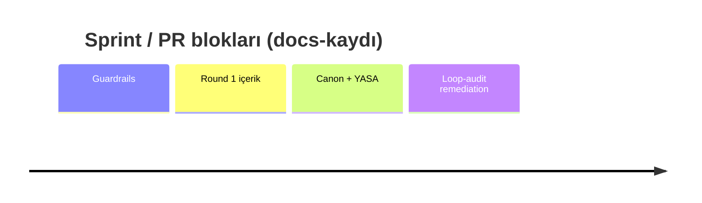

# Sprint Timeline

> [!canon] Bu not PR/sprint bloklarının **kronolojisidir**. Numaralar
> (`#N`) status dokümanlarında kaydedildiği haliyle alınmıştır.
> Güncel PR haritası için [[PR Map]] ve [[Commit and Milestone Timeline]]'a bak;
> bu not tarihsel bloklara odaklanır.

> [!warning] **Shallow-clone uyarısı (load-bearing).** Çalışılan klon **sığdır:
> 50 commit, `2bfc1b6` (#146) → `02f9f7a` (#196)**. #146'nın altındaki PR
> numaraları (Round 1 #100–#142, learning-engine #18–#112, YASA/founder-self-
> learning, Cairn import) **yerel git objelerinden değil**, bunları kaydeden
> status dokümanlarından alıntıdır. Yani bu blokların commit içeriği yerel klonda
> doğrulanamaz — sadece rapor edilmiştir (`reported-only`).

## Blok haritası

---

## 1. #100–#116 — Dev APK guardrails (hepsi merged)

> [!historical] Bu blok yerel klonun altında (`reported-only`). Amaç: tester'a
> yanlış yüzey sevk etmeyi test ile imkânsız kılmak.

| PR | Ne |
|---|---|
| #100 | feature-scope lock by test |
| #101 / #110 | copy guards (banned XP/streak dili) |
| #102 | bug-closure checkpoint |
| #103 | `validate:pools` in CI |
| **#104** | **fail-closed stage** (unset/mistyped env → `dev-apk`, `sandbox` değil) |
| #106 / #107 | Practice hidden |
| #108 | `app/dev/*` gated |
| #109 / #111 / #112 | engine test depth |
| #113 | AI diagnostics removed |
| #114 | `aiEnabled` master switch (sandbox-only) |
| #115 | `/auth` guarded when Supabase env absent |
| #116 | Round 1 checklist |

Güncel karşılık: [[Product Stages and Feature Flags]], [[Validation Gates]].

## 2. #119–#142 — Round 1 L0–L6 content (`reported-only`)

- #119 structural tests · #121 L1 Survival Kit + L2 Être seed · #122 test plan ·
  #124 L3–L6 content plan · #125 Training Content Factory contract · #126 L3 Non
  (ilk factory dersi) · L4/L5 Training Pack · **#130 L6 Un petit moment**
  (`abb0b10`, integration payoff, +chunk-au-revoir) · #131 anti-memorization
  varyasyon pası (`66d7aa7`) · **#136 time-aware Home greeting** (`8cefe81`,
  **Round 1 runtime ACCEPTED**) · #138 Weave cloze fix · **#139 rebuilt Lesson
  Zero** · #140 android-smoke helper · #141 cap rebuild hints · #142 compact L7
  doorway doc → o dönemin main'i **`91f1b04`**.
- Güncel karşılık: [[Runtime Lesson Map]], [[L0 The First Step]], [[Smoke Test Playbook]].

## 3. Cairn import geçiş bloğu (#146–#175, yerel git penceresinde başlar)

- `2bfc1b6` (#146) Cairn product system map v0.1 · `60bfda3` (#147) docs
  README/precedence · `c5ccf06` (#148) dev-apk checklist ↔ L0 handoff.
- Say It Your Way polish #149–#155; #156 remove passive `oui` from L3 recap.
- Faz 1–6A içerik/motor: `0c9795d` chip taxonomy + lexique lifecycle · `4aa4072`
  atomize L4/L6 recaps · `f32c096` roadmap guards + Error Engine v0 · `0a04068`
  lexique numeric contract → `1743f07` derived lexique memory → `03c29ea`
  carryover selector v0 · `909e781` Faz 5 decision gate · `0371e10` Faz 6 content
  factory contract · telemetry v0 `ae793a3` · event compaction v0 `015f343` ·
  içerik pilot `4debc25` (L7–L9), `4d74219` (L10–L12), `84a5b8e` (L13–L15),
  `beb4331` (L1–L15 chip audit), `9c799d9` registry hygiene.

## Kaynak içe aktarımı — Round 1.1 / 1.2 (2026-06-29 vault, upload)

> [!historical] Bu blok, 2026-06-29 tarihli operatör-vault yüklemesinden içe
> aktarıldı ve **#142 ile #176 arasına** oturur (yerel git window'unda, #146–#156).
> "Current main" o notlarda `2df3469`'dur — **güncel HEAD `02f9f7a` (#196)'nın
> gerisinde**, yani tarihsel/karar-zenginleştirme, canon override değil.

Round 1, `8cefe81`/#136 runtime kabulünden sonra **iki polish turuna** ayrıldı:

| PR | Commit | Tip | Ne | Kaynak |
|---|---|---|---|---|
| #151 | `17eec7b` | Runtime UI copy/tone | Weave label netleştirildi + compare tonu yumuşatıldı (`Weave.tsx`) | `PR_and_Smoke_Log.md` |
| #152 | `5f967ec` | Runtime UX | Say It Your Way'e onay adımı eklendi (`SayItYourWayV1.tsx`) | `PR_and_Smoke_Log.md` |
| #153 | `ed85c07` | Content polish | L2/L4/L5 chip + prompt copy temizliği | `PR_and_Smoke_Log.md` |
| **#154** | **`8cfdce75`** | Content fix | L2 eksik `ici` chip kapsamı → **Round 1.1 baseline main** | `PR_and_Smoke_Log.md` |
| #155 | `5f27eee` | Runtime UI copy/label | Round 1.2 — Weave branding restore + target salience (`Weave` badge, `Say this:` / open-suppressed, dominant hedef, helper, `Your try`; yeni saf `weaveCopy.ts` + testler) | `PR_and_Smoke_Log.md`, `Agent_Handoff.md` |
| **#156** | **`2df3469`** | Content polish | Round 1.2 — L3 recap `piecesUsed`'dan passive `oui` kaldırıldı (`non` kaldı) → o notların "current main"i | `PR_and_Smoke_Log.md`, `Agent_Handoff.md` |

- **Round 1.1 verdict = GO / tester-ready.** APK EAS'ten build edildi, emülatörde
  smoke edildi ve **Haktan tarafından fiziksel cihazda spot-check** edildi:
  **fiziksel TTS OK** (emülatör-only TTS caveat kapandı), blocker yok. Tester 1
  (ilk dış tester) L0–L6'yı ~20–25 dk'da olumlu tamamladı; tek non-blocking sinyal
  = Weave prompt-salience (önceki cevabı tekrar yazma). [VERIFIED: device @
  `8cfdce75`, #196'ya göre HISTORICAL] (kaynak: `Tester_Feedback_Log.md`)
- **Round 1.2 (#155 + #156) MERGED ama APK/smoke-doğrulanmadı** — yalnız
  code-validated (typecheck / content 0/0/0 / pools 6 known / testler 328/328).
  Salience düzeltmesi (#155) henüz cihazda **teyit edilmedi.** [IMPLEMENTED,
  code-validated, NOT device-verified]
- **Round 1.2 workflow kararı:** her küçük PR'da build/smoke yapma; durak
  noktalarında batch APK + checklist smoke, vault'a durak sonunda logla.
- Build çıktıları: [private EAS/APK artifacts held in operator vault] — URL/ID yok.
- Güncel karşılık: [[Device Verification Matrix]], [[PR Map]], [[03 Current State]].

## 4. #176–#187 — YASA / canon screenless sprint (2026-07-05)

| PR / commit | Ne |
|---|---|
| `0b31c69` | Payload Economy v0 |
| `7e83405` | Exercise Canon v0.4 |
| **`d16aa05` (#176)** | **Lesson Flow Canon v1.0 + deployment roadmap v1.0** |
| **#177** (`fd3d29b`) | **YASA 2 itemId immutability** |
| **#178** (`0513d19`) | **YASA 1 migration rails** (infra-only, sıfır gerçek migration) |
| **#179** (`691cde3`) | **`deriveDrill` + practice selector v0** |
| #181 | screenless closeout |
| **#182** (`53c70b0`) | **karpathy import + K1–K6** |
| #183 | unrecorded-itemId HARD ERROR (K3) |
| #184 | K6 tone-pass scoping |
| #185 | device-day closing package |
| **#186** | **YASA 3 error-tag immutability** |
| **#187** (`f655c19`) | **canon V3/V4/V5 mekanizasyonu** |

Güncel karşılık: [[Lesson Flow]], [[Error Tracking System]], [[Active Decisions]],
[[Claude Code Workflow]].

## 5. #188–#196 — Final loop-audit remediation (2026-07-08 → 07-09)

| PR | Ne | Bulgu |
|---|---|---|
| #188 | non-destructive corrupt-storage (PR-A) | B2/B3 |
| #189 | scoring/progression fixes | B1/B11/B21 |
| #190 | shared-blob write clobbering | B6 |
| #191 | AI edge hardening | B4/B15 |
| #192 | telemetry in reset/export + secure auth tokens | B9/B19 |
| #193 | PR-E1 | B7/B12 |
| #194 | PR-E2 | B8/B23 + Codex P1 |
| — | fable5-protocol skill + Stop hook | `60819e6` / `d5d8baa` |
| #195 | reconcile loop audit v2 | — |
| **#196** | **PR-H local reset/export coverage** | → **HEAD `02f9f7a`** |

İki loop audit dokümanı ve bulgu envanteri (B1–B24, C1–C30): [[Superseded Specs]]
ve güncel [[Known Gaps]] / [[Technical Debt]].

> [!open-loop] PR #197 (privacy) **paused**, merge edilmedi, 17 unresolved thread,
> head `fd22c40` (session brief; canlı doğrula) → [[05 Open Loops]].

## Related Notes
- Yukarı: [[00 Le Mot Holy Codex]] · [[History Index]]
- Kardeş: [[Product Timeline]] · [[Historical Canon Map]]
- Güncel karşılıklar: [[PR Map]] · [[Commit and Milestone Timeline]] · [[Implementation Ledger]]
