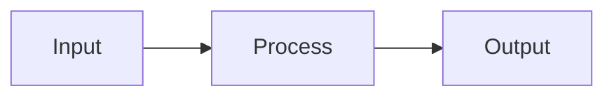

# <Sistem Adı>

<!-- gh-toc -->

## İçindekiler

- [Executive Summary](#executive-summary)
- [Why It Exists](#why-it-exists)
- [Current Canon](#current-canon)
- [How It Works](#how-it-works)
- [Failure Modes](#failure-modes)
- [Examples](#examples)
- [Diagrams](#diagrams)
- [Runtime Implementation](#runtime-implementation)
- [Known Gaps](#known-gaps)
- [Open Questions](#open-questions)
- [Decision History](#decision-history)
- [Related Notes](#related-notes)

> [!canon] Purpose — Bu not neyi cevaplar? (tek cümle)

## Executive Summary
<2-4 cümle: bir yöneticinin/yeni gelenin 20 saniyede anlaması gereken öz.>

## Why It Exists
<Bu sistem hangi problemi çözüyor? Neden var?>

## Current Canon
<Şu an geçerli karar/kural. Kaynak dosyaya link ver.>

## How It Works
### Inputs
### Outputs
### State / Lifecycle
### Main Rules
### Guardrails

## Failure Modes
<Ne zaman bozulur? Hata durumunda ne olur (explicit fail)?>

## Examples
> [!example]
> <somut örnek — French/kod dâhil>

## Diagrams

<diyagramdan sonra düz dille açıklama>

## Runtime Implementation
### Code References
<`lemot-app/...` dosya:satır>
### Test References
### Product-Stage Availability
<sandbox / dev-apk / public-beta>

## Known Gaps
## Open Questions
> [!open-loop] <açık soru> → [[05 Open Loops]]

## Decision History
<İlgili `ADR-XXXX` kayıtlarına link.>

## Related Notes
